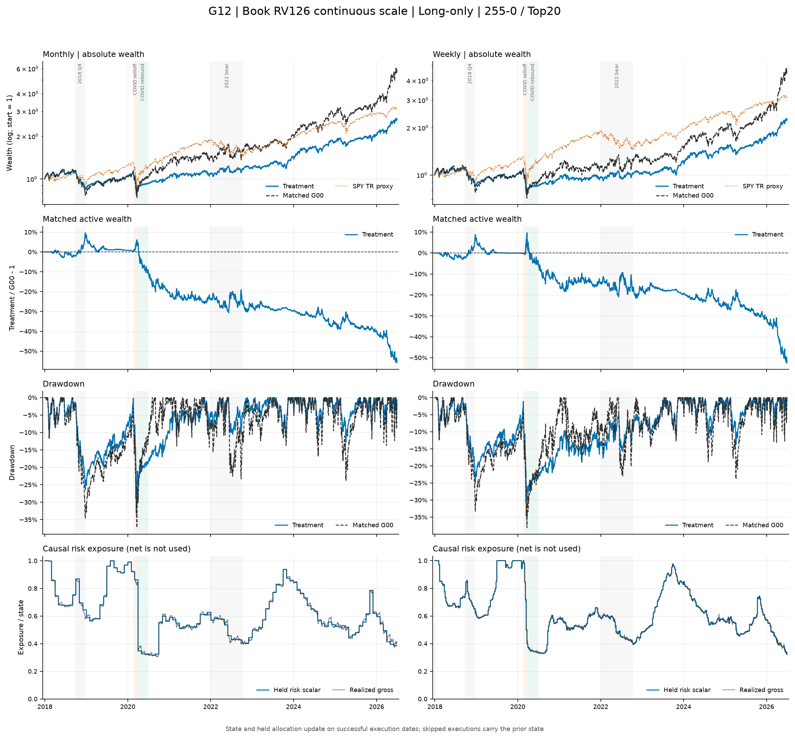
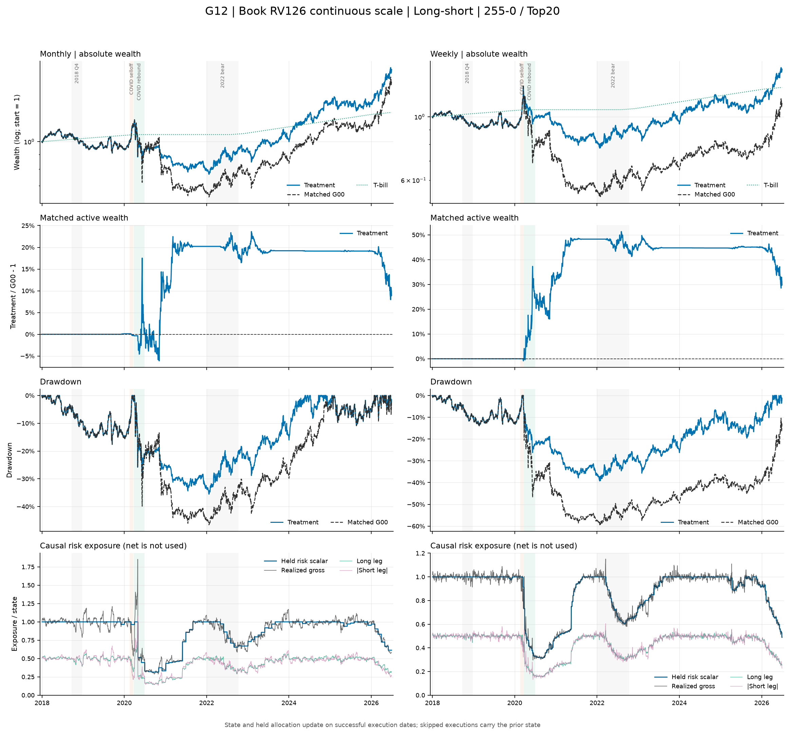

# G12：裸账簿历史波动率连续 15% 目标缩放——结果报告

状态：**已完成；运行、因果性与会计审计有效，但预注册 long-only H1 明确失败。** 本报告只对应冻结数据 v3 与不可变运行 `g12-frozen-v3-v2`。G00 是唯一正式对照；G11、G32 只在 G12 完成并通过验收后用于风险源/动作解释，不是运行输入，也不是正式 reference。

## 一句话结论

裸账簿 RV126 连续 15% 目标缩放明显过度保险 long-only：18 个主场景中 CAGR 与 T-bill 超额 Sharpe 改善均为 **0/18**，最大回撤改善 16/18，但 Sharpe 与 MDD 同时改善仍为 **0/18**，预注册 H1 明确失败。平均 CAGR/Sharpe 从 G00 的 18.87%/0.645 降至 9.10%/0.426，平均 MDD 从 -40.87% 改善到 -33.58%。Long-short/WML 则有 17/18 个主场景、204/216 个压力场景同时改善 Sharpe 与 MDD，机制较强，但绝对 CAGR/Sharpe 仅 4.88%/0.208，仍不足以支持部署。事后同键比较中，G12 的 LO 比 G11、G32 都差，而 LS 比二者平均更好；这不能改写正式 G12-G00 判定。18 个 LO 路径的部署联合通过为 **0/18**，且 `formal_run_eligible=false`。

## 主场景曲线诊断

下图只使用冻结 completed bundle 的 **primary 主成本场景**（月频 5bps、周频 10bps；long-short 年化借券费 1%）。主动财富为严格同键的 `G12 / G00 - 1`；long-short 面板中的 SPY 只作市场环境背景，不是同风险基准。

图表是 completed bundle 上的只读诊断，用于观察路径和暴露，不改变预注册假设、门槛或正式判定。

## 运行与审计有效性

- 冻结设计 SHA256 为 `5c8b66da4287b3229eb51cd6afb2fc0485df3515056cceb1b1e85e893dc0dcb9`，运行时 G12 配置为 `d1aed4c75d69b650e132d575864667153ca82baad0aef59f58159d8168d992fa`，程序配置为 `11394af02fa028abe4a11434874be31e33e692f55feb73e9236da9bf8d07d413`，resolved spec 为 `f70ee19862b98460f6e8bd4977d3524956f62e04d856fb5080503e31c4a26d23`。
- 运行完成后，当前 `G12.toml` 只把台账状态改为 completed，因此当前文件哈希会不同；bundle provenance 与 `config_resolved.toml` 保留的是运行时冻结输入，不能用后验台账哈希覆盖。
- 冻结数据 manifest 为 `65b628d604f7e2f456e8d1d43a3c3e88b6bd3e86cc1c9455cdcfe28b856a3ec7`，FROZEN 为 `a3ef9ee72cd3d535c2e5bf06b3d1f520c54667a8552891543ee0f9ca50488296`；数据保持 `review / free_research_candidate / formal_run_eligible=false`。
- 唯一正式 reference 是 G00 `g00-frozen-v3-v1` / `8b875d4bcbb7b178b309c7b1edaa7dce9bbb15090e68b619fb045cec35411c66`。manifest 没有 G11/G32 runtime root 或 manifest 锚。
- 首次建议 ID `g12-frozen-v3-v1` 在任何 bundle 写出前，由日度 quartile 审计器把数值等价的 `1.0` 与 `1` 作字符串比较而 fail closed；该目录从未创建。修复仅把 validator 改为数值比较，规则、状态与输出均未改变。依设计的 implementation-failure 纪律，正式结果使用新 ID `g12-frozen-v3-v2`。
- 最终 manifest SHA256 为 `db80b885245427ba2684dddcd267ddecb029f2daeeaa6b68fd746e5dd8ccf5e1`，完整 9-file tree SHA256 为 `a3d5708d143d79c3ab51d0472c05f3f16398364e98a796d679630b7e07867dce`。八个受 manifest 约束的文件逐字节、逐 SHA256 复核为零失败。整树聚合统一采用 `relative_path|bytes|sha256` 按相对路径排序并以 LF 连接；先前工作草稿中的 `693907...` 不是该统一口径，已在发布前更正：

| 产物 | 字节 | SHA256 |
|---|---:|---|
| `artifacts/diagnostics.parquet` | 4,940,061 | `9d7d12cce38e4128f298a9d1a4b9cd7f3dd5e90afcf03bfc72076e02e878283c` |
| `artifacts/holdings.parquet` | 740,133 | `8ba382943f949a91245a10ce248b6282a94cc7f2c0ee812036ea3f9500f9ea09` |
| `artifacts/nav.parquet` | 80,052,191 | `e5155bb5cbaa7b1615cc79985d49051ac44da2db8b5ce5cb0423faa262bca2a3` |
| `artifacts/rebalances.parquet` | 2,444,049 | `9e51be35f4ac93f66b7641073c3d456b493986af4f3d4ab14470c7575bb0ae25` |
| `artifacts/trades.parquet` | 8,135,957 | `96b62bc2636e3379c5c18b2a6ada7c781c02122f26712cecea5c3eb55f3f0683` |
| `comparison.csv` | 255,835 | `e772fa38e6ab2241648a779b27df27def1f78c84bcc2b249ead8575642c20e3f` |
| `config_resolved.toml` | 5,691 | `de45a85af7be57c55528cb28ceb412590d00869e50b4e895e60782a89eb6f887` |
| `summary.csv` | 235,101 | `736e11838a63092bc16b4d51990d921e8d4f71c5130ead29dd29a4ff58c2e608` |

- 运行包含 36 条核心路径、72 条零成本事件路径、288 个报告场景、36 个主场景和 1,440 行 G12-G00 比较；LO/LS 场景为 72/216。614,592 行 NAV 恰为 `288×2,134`，另有 9,828 行主调仓、388,872 行持仓、448,196 行交易与 115,272 行诊断。
- 36 条裸账簿各有 3,018 个权威日历日，`daily_naked_regime=108,648`。从存储 book return 独立复算 current-close RV126、`ddof=1`、`sqrt(252)`、严格 `shift(1)` 的 756 日 quartile、`a=min(1,.15/RV126)`、scaled RV 与 cap，最大误差均为 0；正式信号零缺失。
- G12/G00 的调仓键、日期、状态、选股、缺价/公司行动字段和持仓键逐位相同；G12 目标权重仅为 G00×a。9,763 次正常执行、49 次 pending corporate action skip、16 次 signed missing-open skip 均通过；65 次 skip 为零换手、零成本并保持原账簿。
- 8 次 LO `leave_cash` 令实际 filled gross 低于请求 a，最大差 2.198 个百分点；未成交额度留现金。请求标量和持仓缩放 identity 不受影响。
- NAV 日收益复算最大误差 `4.441e-16`，P&L closure 最大 `3.469e-18`，unexplained bridge 最大 `9.09e-16`；1,672 个 material action-bridge 行全部带冻结证据，零个证据失败，bridge 最大绝对值 0.05035。成本、借券、T-bill、cash、gross/net 和跨压力状态审计全部通过。相同 run ID 在加载大数据前由 `FileExistsError` 拒绝。

因此 bundle 可用于本次原型研究的经济判定。大型 Parquet 只保留在本地运行区；精简结果见 [published summary](../../../results/published/G12/summary.csv) 与 [正式 G12-G00 comparison](../../../results/published/G12/comparison.csv)。

## 主场景与 H1

主场景固定为周频 10bps、月频 5bps，LS 借券费 1%。下表为每个模式 18 条路径的算术平均。

| 模式 | 来源 | CAGR | T-bill 超额 Sharpe | MDD | 年化波动 | beta | 年化 L1 |
|---|---|---:|---:|---:|---:|---:|---:|
| LO | G00 | 18.87% | 0.645 | -40.87% | 29.04% | 1.157 | 11.56 |
| LO | G12 | **9.10%** | **0.426** | **-33.58%** | **17.53%** | **0.709** | **7.50** |
| LS | G00 | 3.04% | 0.108 | -48.13% | 19.45% | -0.064 | 12.02 |
| LS | G12 | **4.88%** | **0.208** | **-33.66%** | **14.56%** | **-0.038** | **10.47** |

相对 G00，G12 LO 平均变化为 `-9.770pp CAGR / -0.2193 Sharpe / +7.294pp MDD / -11.509pp vol / -0.449 beta / -4.062 L1`；LS 为 `+1.843pp / +0.1002 / +14.470pp / -4.894pp / +0.026 / -1.554`。

| 范围 | CAGR 改善 | Sharpe 改善 | MDD 改善 | Sharpe+MDD | ΔCAGR中位 | ΔSharpe中位 | ΔMDD中位 |
|---|---:|---:|---:|---:|---:|---:|---:|
| LO 全体 | 0/18 | 0/18 | 16/18 | **0/18** | -10.207pp | -0.2193 | +6.576pp |
| LO 月频 | 0/9 | 0/9 | 7/9 | **0/9** | — | — | — |
| LO 周频 | 0/9 | 0/9 | 9/9 | **0/9** | — | — | — |
| LS 全体 | 18/18 | 17/18 | 18/18 | **17/18** | — | — | — |

H1 要求 LO 联合改善至少 12/18、周/月各 5/9，且 Sharpe 与 MDD 的全体中位 delta 都严格为正。实际所有门槛失败；尤其 Sharpe 0/18 改善，不能用 MDD 的 16/18、LS、危机窗口或 completed 后比较改写结论。

## 36 个主场景

| 模式 | 信号 | K | 频率 | CAGR | ΔCAGR | Sharpe | ΔSharpe | MDD | ΔMDD |
|---|---|---:|---|---:|---:|---:|---:|---:|---:|
| LO | mom_12_1 | 10 | 月 | 9.11% | -13.134pp | .419 | -.2580 | -35.80% | +9.573pp |
| LO | mom_12_1 | 10 | 周 | 10.09% | -13.453pp | .489 | -.2205 | -29.24% | +10.486pp |
| LO | mom_12_1 | 20 | 月 | 8.67% | -10.698pp | .393 | -.2588 | -35.05% | +3.521pp |
| LO | mom_12_1 | 20 | 周 | 9.59% | -11.012pp | .459 | -.2296 | -31.51% | +7.531pp |
| LO | mom_12_1 | 50 | 月 | 8.84% | -7.213pp | .400 | -.2243 | -36.09% | -0.000pp |
| LO | mom_12_1 | 50 | 周 | 7.64% | -6.559pp | .356 | -.2073 | -29.37% | +4.817pp |
| LO | mom_255_0 | 10 | 月 | 11.06% | -12.874pp | .523 | -.1982 | -37.39% | +14.103pp |
| LO | mom_255_0 | 10 | 周 | 8.47% | -9.858pp | .404 | -.1843 | -31.58% | +15.090pp |
| LO | mom_255_0 | 20 | 月 | 12.22% | -11.246pp | .578 | -.2023 | -31.67% | +5.621pp |
| LO | mom_255_0 | 20 | 周 | 10.26% | -10.114pp | .500 | -.1991 | -29.93% | +8.148pp |
| LO | mom_255_0 | 50 | 月 | 9.90% | -7.131pp | .457 | -.2123 | -36.25% | -0.471pp |
| LO | mom_255_0 | 50 | 周 | 7.36% | -5.669pp | .343 | -.1845 | -32.70% | +4.479pp |
| LO | mom_255_21 | 10 | 月 | 8.33% | -11.584pp | .381 | -.2364 | -37.21% | +12.032pp |
| LO | mom_255_21 | 10 | 周 | 6.97% | -9.963pp | .319 | -.2263 | -36.91% | +17.767pp |
| LO | mom_255_21 | 20 | 月 | 9.35% | -10.851pp | .427 | -.2495 | -35.92% | +4.457pp |
| LO | mom_255_21 | 20 | 周 | 8.97% | -10.299pp | .425 | -.2248 | -31.49% | +9.358pp |
| LO | mom_255_21 | 50 | 月 | 8.98% | -6.957pp | .409 | -.2127 | -35.07% | +0.000pp |
| LO | mom_255_21 | 50 | 周 | 8.07% | -7.239pp | .379 | -.2182 | -31.22% | +4.783pp |
| LS | mom_12_1 | 10 | 月 | 6.02% | +0.276pp | .271 | +.0336 | -32.40% | +12.637pp |
| LS | mom_12_1 | 10 | 周 | 4.97% | +2.262pp | .210 | +.0991 | -34.39% | +23.686pp |
| LS | mom_12_1 | 20 | 月 | 6.08% | +1.571pp | .284 | +.1023 | -30.13% | +13.977pp |
| LS | mom_12_1 | 20 | 周 | 5.64% | +2.232pp | .257 | +.1295 | -34.90% | +17.375pp |
| LS | mom_12_1 | 50 | 月 | 5.26% | +1.482pp | .248 | +.1115 | -24.00% | +8.852pp |
| LS | mom_12_1 | 50 | 周 | 3.49% | +1.810pp | .115 | +.1142 | -33.42% | +10.027pp |
| LS | mom_255_0 | 10 | 月 | 3.32% | +0.477pp | .112 | -.0128 | -46.39% | +12.221pp |
| LS | mom_255_0 | 10 | 周 | 2.92% | +4.733pp | .085 | +.1544 | -40.09% | +27.466pp |
| LS | mom_255_0 | 20 | 月 | 7.14% | +1.076pp | .341 | +.0867 | -35.54% | +11.024pp |
| LS | mom_255_0 | 20 | 周 | 4.62% | +3.172pp | .190 | +.1519 | -39.25% | +20.130pp |
| LS | mom_255_0 | 50 | 月 | 5.65% | +1.535pp | .274 | +.1151 | -28.58% | +8.901pp |
| LS | mom_255_0 | 50 | 周 | 2.53% | +2.449pp | .043 | +.1375 | -36.55% | +12.294pp |
| LS | mom_255_21 | 10 | 月 | 5.09% | +0.342pp | .216 | +.0196 | -31.31% | +13.433pp |
| LS | mom_255_21 | 10 | 周 | 2.78% | +2.730pp | .075 | +.0793 | -39.08% | +19.923pp |
| LS | mom_255_21 | 20 | 月 | 7.53% | +1.544pp | .375 | +.1215 | -28.77% | +13.739pp |
| LS | mom_255_21 | 20 | 周 | 5.80% | +2.396pp | .268 | +.1417 | -34.45% | +17.237pp |
| LS | mom_255_21 | 50 | 月 | 5.07% | +1.463pp | .235 | +.1089 | -25.21% | +8.613pp |
| LS | mom_255_21 | 50 | 周 | 3.96% | +1.617pp | .150 | +.1092 | -31.51% | +8.920pp |

唯一没有改善 Sharpe 的 LS 主场景是 `mom_255_0/top10/monthly`；其 CAGR/MDD 仍改善。分组均值如下：

| 模式/维度 | 组 | G12 CAGR / ΔG00 | Sharpe / ΔG00 | MDD / ΔG00 | 联合 |
|---|---|---:|---:|---:|---:|
| LO 信号 | mom_12_1 | 8.99% / -10.345pp | .419 / -.2331 | -32.84% / +5.988pp | 0/6 |
| LO 信号 | mom_255_0 | 9.88% / -9.482pp | .468 / -.1968 | -33.25% / +7.828pp | 0/6 |
| LO 信号 | mom_255_21 | 8.44% / -9.482pp | .390 / -.2280 | -34.64% / +8.066pp | 0/6 |
| LO K | Top10 | 9.01% / -11.811pp | .423 / -.2206 | -34.69% / +13.175pp | 0/6 |
| LO K | Top20 | 9.84% / -10.703pp | .464 / -.2273 | -32.59% / +6.439pp | 0/6 |
| LO K | Top50 | 8.46% / -6.795pp | .391 / -.2099 | -33.45% / +2.268pp | 0/6 |
| LO 频率 | 月 | 9.61% / -10.187pp | .443 / -.2281 | -35.60% / +5.426pp | 0/9 |
| LO 频率 | 周 | 8.60% / -9.352pp | .408 / -.2105 | -31.55% / +9.162pp | 0/9 |
| LS 信号 | mom_12_1 | 5.24% / +1.606pp | .231 / +.0984 | -31.54% / +14.426pp | 6/6 |
| LS 信号 | mom_255_0 | 4.36% / +2.240pp | .174 / +.1055 | -37.73% / +15.339pp | 5/6 |
| LS 信号 | mom_255_21 | 5.04% / +1.682pp | .220 / +.0967 | -31.72% / +13.644pp | 6/6 |
| LS K | Top10 | 4.18% / +1.803pp | .162 / +.0622 | -37.28% / +18.228pp | 5/6 |
| LS K | Top20 | 6.13% / +1.999pp | .286 / +.1223 | -33.84% / +15.580pp | 6/6 |
| LS K | Top50 | 4.33% / +1.726pp | .177 / +.1161 | -29.88% / +9.601pp | 6/6 |
| LS 频率 | 月 | 5.68% / +1.085pp | .262 / +.0763 | -31.37% / +11.489pp | 8/9 |
| LS 频率 | 周 | 4.08% / +2.600pp | .155 / +.1241 | -35.96% / +17.451pp | 9/9 |

## 连续动作与 quartile 诊断

9,828 个主调仓中有 7,018 个 `a<1`；最小正式 a 为 0.2612。Quartile 只用于分组，连续动作在 Q1–Q3 也大量发生：

| 信号 quartile | n | RV126均值 | a均值 | a min/P25/P50/P75/max | a×RV min/max | a<1 |
|---|---:|---:|---:|---:|---:|---:|
| Q1 | 1,728 | .1463 | .9093 | .493/.836/1/1/1 | .063/.150 | 829 |
| Q2 | 2,658 | .1671 | .8618 | .411/.736/.965/1/1 | .072/.150 | 1,412 |
| Q3 | 2,303 | .2186 | .7298 | .364/.553/.718/.939/1 | .078/.150 | 1,897 |
| Q4 | 3,139 | .2989 | .5660 | .261/.403/.532/.665/1 | .083/.150 | 2,880 |

LO 在评价期 38,412 个 path-days 中有 36,440 个 `a<1`，形成 84 段，平均/中位/最长为 433.8/152.5/2,134 sessions；LS 为 18,201/38,412、164 段、111.0/18/1,060 sessions。部分 LO 路径整段评价期都低于 15% 目标的满仓阈值，这正是长期机会成本的来源，而不是仅在尾部状态买保险。

## Q1–Q4 持有期

事件收益使用本次成功执行 postcost NAV 到下一次**计划**调仓前 pretrade NAV；65 个 skip 单列，最后 36 个无下一期 pretrade 的事件排除。以下把同模式/频率的 9 条主路径事件池化，每个 path-event 等权。

| 模式/频率 | Q | n | G00均值 | G12均值 | G00中位 | G12中位 | G00/G12胜率 | G00/G12 ES10 | G00/G12最差 |
|---|---:|---:|---:|---:|---:|---:|---:|---:|---:|
| LO 月 | Q1 | 155 | 1.501% | 1.341% | 1.317% | 1.053% | 57.4% / 59.4% | -7.794% / -6.081% | -10.241% / -7.792% |
| LO 月 | Q2 | 180 | 1.011% | .698% | 1.377% | 1.093% | 58.3% / 58.3% | -10.408% / -7.527% | -28.375% / -21.344% |
| LO 月 | Q3 | 219 | .383% | -.078% | .267% | .185% | 53.0% / 53.0% | -15.032% / -12.057% | -22.457% / -19.326% |
| LO 月 | Q4 | 355 | 3.019% | 1.297% | 3.028% | 1.312% | 67.9% / 68.7% | -10.915% / -5.986% | -22.085% / -10.198% |
| LO 周 | Q1 | 648 | .348% | .264% | .503% | .420% | 56.8% / 56.9% | -4.585% / -4.139% | -7.320% / -6.831% |
| LO 周 | Q2 | 812 | .143% | .118% | .654% | .469% | 59.4% / 59.5% | -7.588% / -5.090% | -13.259% / -7.996% |
| LO 周 | Q3 | 884 | -.108% | -.072% | .017% | .037% | 50.1% / 50.3% | -8.759% / -5.249% | -16.741% / -11.883% |
| LO 周 | Q4 | 1,638 | .842% | .357% | .812% | .438% | 61.1% / 61.7% | -6.902% / -3.485% | -16.658% / -8.173% |
| LS 月 | Q1 | 186 | .749% | .748% | .728% | .728% | 61.3% / 61.8% | -5.845% / -5.741% | -8.359% / -8.359% |
| LS 月 | Q2 | 307 | .725% | .659% | .625% | .567% | 55.7% / 56.4% | -6.108% / -5.616% | -10.325% / -9.074% |
| LS 月 | Q3 | 211 | .262% | .310% | .276% | .258% | 51.7% / 52.1% | -5.837% / -4.886% | -17.477% / -17.477% |
| LS 月 | Q4 | 203 | -.078% | .310% | -.335% | -.165% | 48.8% / 48.8% | -15.239% / -9.163% | -26.771% / -23.334% |
| LS 周 | Q1 | 735 | .194% | .197% | .194% | .194% | 54.0% / 54.0% | -2.727% / -2.661% | -4.717% / -4.573% |
| LS 周 | Q2 | 1,327 | .022% | .031% | .063% | .062% | 52.5% / 52.6% | -3.538% / -3.223% | -8.530% / -8.530% |
| LS 周 | Q3 | 984 | .122% | .134% | .101% | .092% | 52.1% / 52.2% | -4.226% / -3.187% | -7.986% / -7.571% |
| LS 周 | Q4 | 883 | -.031% | .111% | .018% | .019% | 50.3% / 50.4% | -8.406% / -4.826% | -28.847% / -12.178% |

连续缩放普遍改善左尾，却在 LO Q4 明显放弃正均值：月频少 1.722pp、周频少 .485pp。LS Q4 则改善均值和极端左尾，支持 loser-short 风险缩减机制。

## P&L 闭合归因

下表按最近一次成功执行状态划分每日 P&L；skip 期间沿用上次实际状态。单位是每条主路径相对初始 NAV 的绝对贡献均值，不是复合收益。G00 没有原生逐腿列，故使用与 G12 完全相同的 balance-flow identity 从冻结 NAV/rebalances 只读重建；material bridge 仅发生在配对冻结证据日，普通日 residual 低于数值门槛。

| 模式 | 来源 | 总P&L | long | short | T-bill | 成本 | 借券 | action bridge |
|---|---|---:|---:|---:|---:|---:|---:|---:|
| LO | G00 | 3.4212 | 3.4630 | 0 | .0000 | -.1079 | 0 | .0660 |
| LO | G12 | 1.1005 | 1.0203 | 0 | .1035 | -.0573 | 0 | .0340 |
| LS | G00 | .3050 | .7920 | -.5525 | .2068 | -.0689 | -.0366 | -.0359 |
| LS | G12 | .5059 | .7296 | -.3422 | .2456 | -.0716 | -.0368 | -.0187 |

LO 的 `-2.3206` 总 P&L 差几乎全来自 long 风险腿少赚 `-2.4427`；T-bill `+0.1035` 与成本节省 `+0.0506` 远不足以补偿。LS 的 `+0.2009` 改善主要来自 short 腿少亏 `+0.2102`，虽牺牲 long `-0.0624`，仍获得净改善。所有未舍入组件逐日闭合。

按 active quartile 分区的 G12-G00 差值如下；单位和重建口径与上表相同：

| 模式 | active Q | 总差 | long | short | T-bill | 成本 | 借券 | bridge |
|---|---:|---:|---:|---:|---:|---:|---:|---:|
| LO | Q1 | -.1506 | -.1702 | 0 | +.0141 | +.0056 | 0 | -.0001 |
| LO | Q2 | -.0810 | -.1060 | 0 | +.0173 | +.0097 | 0 | -.0020 |
| LO | Q3 | -.1610 | -.2001 | 0 | +.0287 | +.0113 | 0 | -.0009 |
| LO | Q4 | -1.9280 | -1.9663 | 0 | +.0434 | +.0240 | 0 | -.0290 |
| LS | Q1 | +.0253 | +.0273 | -.0073 | +.0078 | -.0019 | -.0008 | +.0002 |
| LS | Q2 | +.0251 | +.0231 | -.0106 | +.0174 | -.0035 | -.0015 | ~0 |
| LS | Q3 | +.0272 | +.0102 | +.0078 | +.0099 | -.0010 | -.0003 | +.0006 |
| LS | Q4 | +.1234 | -.1231 | +.2203 | +.0037 | +.0037 | +.0023 | +.0164 |

LO 的机会成本集中于 Q4，但 Q1–Q3 也均为负，进一步证明连续动作不是尾部专用保险。LS 的 Q4 改善主要是 short 腿少亏，被 long 腿少赚部分抵销。

## 四个固定危机窗口

日期双端包含；收益含窗口首日 prior-close 到 close。指标为同模式 18 条主路径的算术平均。

| 窗口 | 模式 | 来源 | 收益 | 年化vol | MDD | 最差日 | beta | L1 |
|---|---|---|---:|---:|---:|---:|---:|---:|
| 2018Q4 | LO | G00 | -29.46% | 29.84% | -30.77% | -5.17% | 1.248 | 3.46 |
| 2018Q4 | LO | G12 | -21.46% | 21.82% | -22.53% | -4.22% | .902 | 2.58 |
| 2018Q4 | LS | G00/G12 | -3.27% | 10.79% | -7.59% | -1.65% | .089 | 3.34 |
| COVID 下跌 | LO | G00 | -37.00% | 83.74% | -37.83% | -13.18% | 1.091 | 1.27 |
| COVID 下跌 | LO | G12 | -30.92% | 65.91% | -31.75% | -10.19% | .856 | 1.09 |
| COVID 下跌 | LS | G00 | +12.60% | 24.35% | -3.82% | -2.32% | .014 | 1.36 |
| COVID 下跌 | LS | G12 | +12.29% | 23.29% | -3.57% | -2.20% | .012 | 1.28 |
| COVID 反弹 | LO | G00 | +39.77% | 41.47% | -9.07% | -5.11% | .988 | 3.97 |
| COVID 反弹 | LO | G12 | +15.88% | 20.46% | -5.03% | -2.58% | .463 | 1.59 |
| COVID 反弹 | LS | G00 | -20.19% | 50.60% | -36.23% | -8.84% | -.536 | 4.57 |
| COVID 反弹 | LS | G12 | -14.22% | 32.35% | -24.17% | -6.06% | -.330 | 3.26 |
| 2022 熊市 | LO | G00 | +1.01% | 33.42% | -23.23% | -8.66% | .892 | 8.37 |
| 2022 熊市 | LO | G12 | +1.23% | 16.76% | -11.54% | -4.74% | .463 | 4.59 |
| 2022 熊市 | LS | G00 | +14.93% | 19.62% | -13.91% | -3.79% | -.268 | 9.44 |
| 2022 熊市 | LS | G12 | +12.69% | 16.65% | -11.02% | -3.14% | -.220 | 8.43 |

| 窗口 | 模式 | 平均a | 最低a | a<1日/路径 | a<1调仓/路径 | Q1/Q2/Q3/Q4日/路径 |
|---|---|---:|---:|---:|---:|---:|
| 2018Q4 | LO | .719 | .503 | 61.9 | 8.0 | 0.0/.4/22.4/42.2 |
| 2018Q4 | LS | 1.000 | 1.000 | 0.0 | 0.0 | 10.7/46.3/8.0/0.0 |
| COVID 下跌 | LO | .680 | .341 | 21.0 | 2.6 | 2.9/3.7/6.4/11.0 |
| COVID 下跌 | LS | .961 | .634 | 10.2 | 1.2 | 0.0/0.0/.9/23.1 |
| COVID 反弹 | LO | .314 | .264 | 69.0 | 8.5 | 0/0/0/69.0 |
| COVID 反弹 | LS | .624 | .276 | 61.6 | 7.8 | 0/0/.6/68.4 |
| 2022 熊市 | LO | .514 | .325 | 196.0 | 25.5 | 0/53.1/42.9/99.9 |
| 2022 熊市 | LS | .869 | .507 | 101.7 | 13.7 | 41.1/38.4/116.4/0 |

G12 的危机保护是真实的，但 COVID 反弹期 LO 18/18 路径 69 日全程缩放，平均只赚 15.88%，相对 G00 少 23.89pp；这比下跌期减损 6.08pp 大得多，是全样本 CAGR/Sharpe 失败的直接路径解释。

窗口 P&L 组件同样闭合。下表为 G12-G00 的窗口前 NAV 归一化贡献差；正成本/借券值表示拖累减少。

| 窗口 | 模式 | 总差 | long | short | T-bill | 成本 | 借券 | bridge |
|---|---|---:|---:|---:|---:|---:|---:|---:|
| 2018Q4 | LO | +.0800 | +.0802 | 0 | +.0016 | +.0006 | 0 | -.0023 |
| 2018Q4 | LS | 0 | 0 | 0 | 0 | 0 | 0 | 0 |
| COVID 下跌 | LO | +.0608 | +.0604 | 0 | +.0004 | +.0001 | 0 | 0 |
| COVID 下跌 | LS | -.0031 | +.0069 | -.0102 | ~0 | +.0001 | ~0 | 0 |
| COVID 反弹 | LO | -.2389 | -.2334 | 0 | +.0002 | +.0028 | 0 | -.0086 |
| COVID 反弹 | LS | +.0596 | -.0258 | +.0853 | ~0 | +.0009 | +.0004 | -.0012 |
| 2022 熊市 | LO | +.0022 | +.0030 | 0 | +.0029 | +.0032 | 0 | -.0068 |
| 2022 熊市 | LS | -.0224 | -.0041 | -.0187 | ~0 | +.0010 | +.0005 | -.0012 |

## 压力、事后比较与部署

- LO 全部 72 个成本场景：CAGR 0/72 改善、Sharpe 0/72、MDD 63/72、联合 0/72。失败不是交易成本造成。
- LS 全部 216 个成本×借券场景：CAGR 216/216、Sharpe 204/216、MDD 216/216、联合 204/216；12 个压力格每格均为 17/18 联合改善。最严 20bps+3% 下，平均 CAGR/Sharpe/MDD 为 2.72%/0.064/-36.67%，相对 G00 为 `+2.118pp / +0.0816 / +14.546pp`。机制稳健，但绝对表现仍弱。

G11/G32 比较发生在 G12 completed 后，仅用于解释：

| 模式 | 对照 | ΔCAGR | ΔSharpe | ΔMDD | Δvol | Δbeta | ΔL1 | 三项改善计数 |
|---|---|---:|---:|---:|---:|---:|---:|---:|
| LO | G12-G11 | -6.068pp | -.1592 | -2.737pp | -6.805pp | -.143 | -3.507 | 0/18 |
| LO | G12-G32 | -5.188pp | -.1003 | +6.844pp | -9.400pp | -.351 | -3.414 | 0/18 |
| LS | G12-G11 | +.115pp | +.0145 | +2.947pp | -1.059pp | -.041 | -.592 | 10/18 |
| LS | G12-G32 | +.488pp | +.0297 | +2.557pp | -.776pp | -.004 | -.669 | 9/18 |

G12 比 G11/G32 进一步压低 LO 风险，却同时大幅降低 CAGR/Sharpe，说明失败来自连续保险与路径级 RV126 的组合，而非风险不足。LS 对 short 风险的持续缩放反而在多数同键路径优于两者。

冻结 SPY 代理 CAGR 为 14.6210%。G12 的 18 个 LO 主场景中，`CAGR>SPY` 为 0/18，`Sharpe>1` 为 0/18，`MDD>-25%` 为 0/18，三项联合为 **0/18**。没有数值部署候选；即使有，当前数据与代理限制也仍令 `formal_run_eligible=false`。

## 结论与下一步

G12 是有效但经济上失败的 LO 实验：连续路径级 RV126 把目标长期压得过低，危机保护没有补偿常态与反弹期的 long 机会成本。LS 的 204/216 压力联合改善证明同步缩放 winner/loser 腿有稳定的风险控制作用，但低绝对收益与低 Sharpe 只支持机制解释。

这轮完成 G12 后停止。计划中尚未完成的同阶段组只剩 G13；旧计划没有冻结 G11–G13 的内部顺序。若继续，必须先在任何 G13 结果前单独冻结其设计、实现与门禁，不能把 G12 的结果回填为 G13 的参数选择。

## 图表附录

全部 primary 路径按频率分面，供逐策略检查：

- [Long-only 月频 atlas](../../figures/round1/G12/atlas-long-only-monthly.png)
- [Long-only 周频 atlas](../../figures/round1/G12/atlas-long-only-weekly.png)
- [Long-short 月频 atlas](../../figures/round1/G12/atlas-long-short-monthly.png)
- [Long-short 周频 atlas](../../figures/round1/G12/atlas-long-short-weekly.png)
