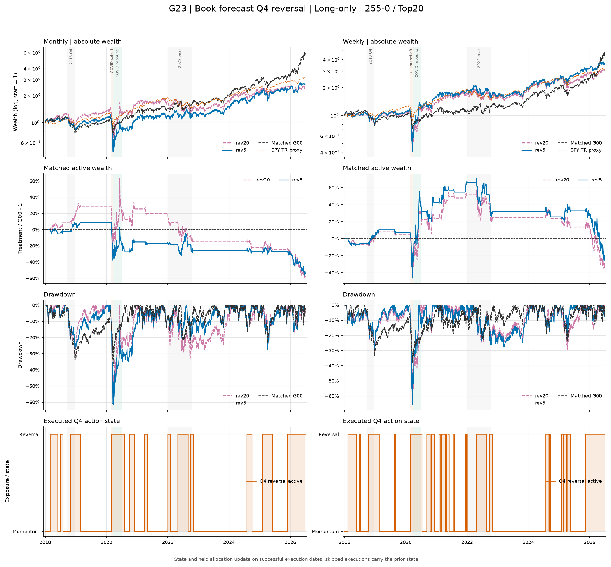
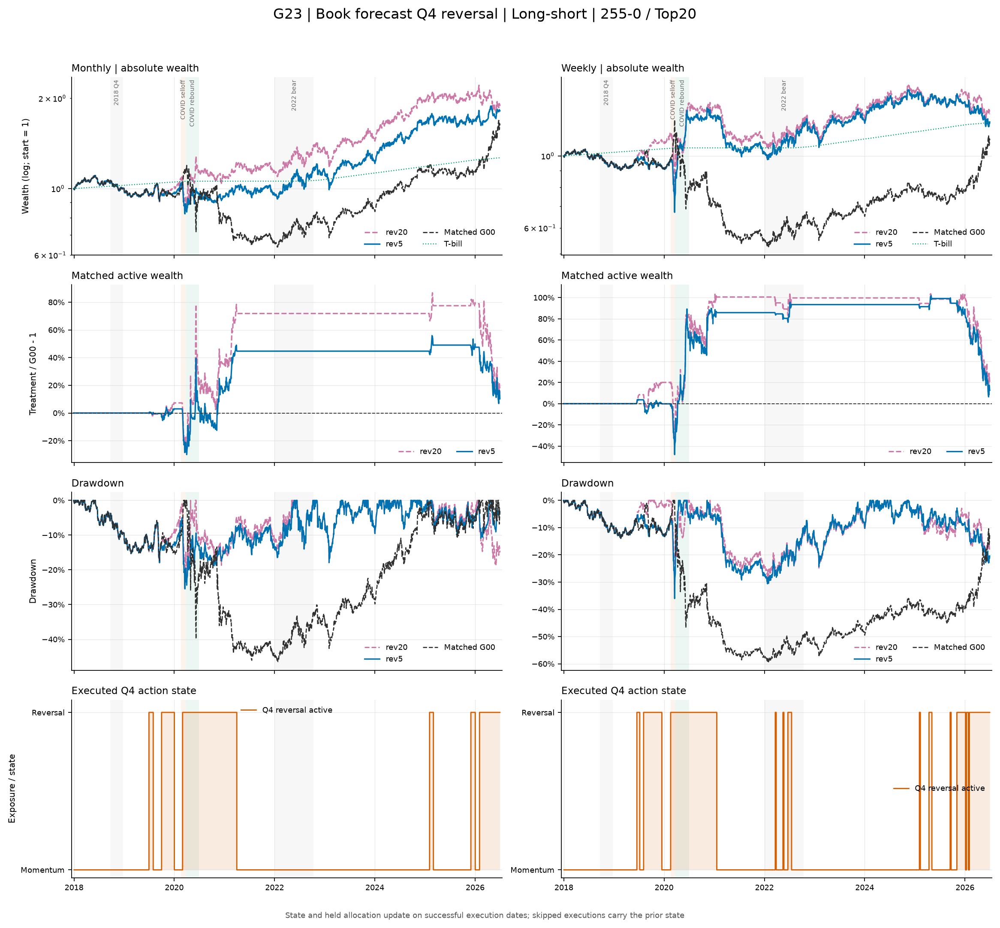

# G23：裸账簿预测波动率严格 Q4 切换反转——结果报告

状态：**已完成；有效运行 `g23-frozen-v3-v1`；`formal_run_eligible=false`。** 预注册设计见 [design.md](design.md)。

## 一句话结论

G23 是主网格最后一格。LO 为 0/36 三项联合改善，Sharpe 0/36、MDD 0/36 改善，H1-LO 明确失败。LS 为 33/36 三项联合改善，月频 15/18、周频 18/18，且三项中位 delta 全正，**通过预注册平台门槛**；但最高 20bps+3% 压力组合降至 23/36，绝对均值也只有 CAGR 5.52%、Sharpe 0.252，因此结论是“LS 反转机制获得平台支持，但仍成本/借券敏感且不构成部署建议”。

## 主场景曲线诊断

下图只使用冻结 completed bundle 的 **primary 主成本场景**（月频 5bps、周频 10bps；long-short 年化借券费 1%）。主动财富为严格同键的 `G23 / G00 - 1`；long-short 面板中的 SPY 只作市场环境背景，不是同风险基准。

图表是 completed bundle 上的只读诊断，用于观察路径与动作切换，不改变预注册假设、门槛或正式判定。

## 冻结输入与不可变证据

下列 G23 config SHA 是运行时冻结锚。运行完成后仅允许把当前台账状态改为 completed，不反写 bundle。

| 锚点 | SHA256 |
|---|---|
| dataset manifest | `65b628d604f7e2f456e8d1d43a3c3e88b6bd3e86cc1c9455cdcfe28b856a3ec7` |
| FROZEN record | `a3ef9ee72cd3d535c2e5bf06b3d1f520c54667a8552891543ee0f9ca50488296` |
| G00 manifest | `8b875d4bcbb7b178b309c7b1edaa7dce9bbb15090e68b619fb045cec35411c66` |
| G23 design | `1f3c3ea2c9079f6e554acb8643c4875b4ebfbaf03443fdf176578352fbe3a077` |
| G23 run-time config | `29a79c3e57a15ce73dda3c6ebe5efc39b4b50ec210ea6c0d3ff85456499146c8` |
| program | `11394af02fa028abe4a11434874be31e33e692f55feb73e9236da9bf8d07d413` |
| manifest | `c0f90d3e864ce29a5f7e7f3a7ea94a26083680749e6b83b1e427138f05d5767f` |
| 9-file tree | `96c8608f498b7fb68e5192609d7163a22748e428bd18cca71073dc741c357c11` |

相同 run ID 的再次执行在加载数据前以 `FileExistsError` 拒绝；原 bundle 指纹不变。

## Bundle 与机制验收

| 项目 | 结果 |
|---|---:|
| 核心路径 / 主场景 | 72 / 72 |
| 全场景（LO / LS） | 576（144 / 432） |
| G00 comparison 行 | 2,880 |
| NAV 行 | 1,229,184 = 576 × 2,134 |
| 主调仓 / Q4 主调仓 | 19,656 / 5,788 |
| daily forecast 行 | 217,296 = 72 × 3,018 |
| holdings / trades | 778,611 / 1,030,509 |
| valid scenarios | 576 / 576 |
| 9 文件 / manifest records | 9 / 8；逐 bytes/SHA 零失败 |

独立只读复算中，EWMA 递推、`21v`、`sqrt(252v)`、严格 `shift(1)` 的 756-session q25/q50/q75 与 quartile 全部逐位一致。预测 sigma 范围为 0.001566–1.092613；rev5/rev20 共享同一基础路径状态。非 Q4 请求选择与敞口逐位等于 G00；共同 Q4 日的反转请求不依赖原 momentum signal。逐日 P&L closure 最大 `3.47e-18`，无证据 unexplained bridge 最大 `1.99e-15`。

## 主场景结果与预注册判定

以下为同模式主场景算术平均；delta 是 G23-G00。MDD 为负数，正 delta 才是改善。

| 模式 | n | CAGR | ΔCAGR | Sharpe | ΔSharpe | MDD | ΔMDD | vol | beta | 三项联合 |
|---|---:|---:|---:|---:|---:|---:|---:|---:|---:|---:|
| LO | 36 | 12.12% | -6.758pp | 0.431 | -0.2137 | -61.86% | -20.990pp | 32.50% | 1.310 | 0/36 |
| LS | 36 | 5.52% | +2.485pp | 0.252 | +0.1437 | -27.15% | +20.989pp | 16.08% | 0.054 | 33/36 |

| 模式 | ΔCAGR>0 | ΔSharpe>0 | ΔMDD>0 | 月频联合 | 周频联合 | 中位 ΔCAGR | 中位 ΔSharpe | 中位 ΔMDD | 判定 |
|---|---:|---:|---:|---:|---:|---:|---:|---:|---|
| LO | 3/36 | 0/36 | 0/36 | 0/18 | 0/18 | -6.658pp | -0.2244 | -20.928pp | H1-LO 失败 |
| LS | 33/36 | 33/36 | 36/36 | 15/18 | 18/18 | +2.259pp | +0.1180 | +21.174pp | H1-LS 通过 |

门槛要求总计至少 24/36、月/周各 10/18，且三项中位 delta 全正。LS 全部满足；LO 全部核心门槛失败。LS 的通过不能挽救 LO。

## variant、频率、signal 与 K

| 模式 | 分组 | n | CAGR / Δ | Sharpe / Δ | MDD / Δ | 联合 |
|---|---|---:|---:|---:|---:|---:|
| LO | rev5 | 18 | 13.28% / -5.589pp | 0.461 / -0.1843 | -62.86% / -21.987pp | 0/18 |
| LO | rev20 | 18 | 10.95% / -7.927pp | 0.402 / -0.2430 | -60.87% / -19.994pp | 0/18 |
| LO | monthly | 18 | 10.47% / -9.326pp | 0.388 / -0.2832 | -59.00% / -17.971pp | 0/18 |
| LO | weekly | 18 | 13.76% / -4.191pp | 0.475 / -0.1441 | -64.72% / -24.010pp | 0/18 |
| LS | rev5 | 18 | 5.98% / +2.944pp | 0.280 / +0.1723 | -27.06% / +21.079pp | 17/18 |
| LS | rev20 | 18 | 5.07% / +2.027pp | 0.223 / +0.1150 | -27.24% / +20.899pp | 16/18 |
| LS | monthly | 18 | 6.58% / +1.980pp | 0.318 / +0.1329 | -23.22% / +19.635pp | 15/18 |
| LS | weekly | 18 | 4.47% / +2.990pp | 0.185 / +0.1545 | -31.07% / +22.343pp | 18/18 |

LO 的三个 signal、三个 K 均为 0 联合；LS 的 signal 分组为 11/12、10/12、12/12，K 分组为 11/12、12/12、10/12。rev5 略强于 rev20，但两者和两个频率都支持 LS 机制，结论不依赖事后挑选单个子组。

## Q4 持有期与 H3

事件收益采用当前成功执行后的 post-cost NAV 到下一计划调仓 pretrade NAV；skip 排除，末次事件因无下一调仓排除。Q1–Q3 由硬门禁保持 G00 选择；下表只列 Q4 的池化 path-event。

| 模式/频率 | n | G00 mean | G23 mean | G00 ES10 | G23 ES10 | G00 ES5 | G23 ES5 | G00 worst | G23 worst |
|---|---:|---:|---:|---:|---:|---:|---:|---:|---:|
| LO monthly | 578 | 3.241% | 2.029% | -16.744% | -23.305% | -19.930% | -35.452% | -28.375% | -51.368% |
| LO weekly | 2,786 | 0.826% | 0.907% | -8.957% | -9.818% | -11.298% | -14.479% | -16.741% | -32.729% |
| LS monthly | 412 | -0.534% | 0.512% | -15.593% | -11.099% | -18.930% | -15.193% | -26.770% | -23.589% |
| LS weekly | 1,921 | 0.109% | 0.500% | -8.181% | -4.652% | -11.290% | -6.543% | -28.847% | -14.771% |

H3-LO 不支持：月频均值下降，两个频率的 ES 与最差事件恶化。H3-LS 支持：月/周的均值、ES10、ES5 与最差事件全部改善。共排除 111 个 skip，均按冻结规则维持持仓、零换手和零成本。

## 状态、选择与预测校准

rev5/rev20 共享状态。去掉 variant 重复后，LO 有 671 个 Q4 episode，平均 21.0 sessions、中位 6、最长 163；LS 有 436 个，平均 23.0、中位 5、最长 250。Q4 中 rev5/rev20 请求 SID 的 Jaccard 均值仅 0.189，说明两种反转窗口是实质不同动作。

forecast calibration 仅为 completed 后描述性结果，不是输入或 H1 选择依据。目标是后续 21 session 的 `sqrt(252×mean(r²))`。

| 模式/频率 | n | forecast 均值 | realized 均值 | bias F-Y | MAE | Pearson |
|---|---:|---:|---:|---:|---:|---:|
| LO monthly | 918 | 25.70% | 26.19% | -0.48pp | 8.02pp | 0.485 |
| LO weekly | 3,960 | 25.97% | 25.99% | -0.02pp | 7.89pp | 0.509 |
| LS monthly | 918 | 16.21% | 16.71% | -0.50pp | 5.12pp | 0.626 |
| LS weekly | 3,960 | 16.61% | 16.83% | -0.21pp | 4.67pp | 0.701 |

预测对 LS 排序信息更强，但“预测相关较高”本身不等于经济成功；经济判定仍只使用预注册 G23-G00 指标。

## 固定危机窗口

下表为同模式/variant 的 18 条主路径等权均值，格式 `G00 → G23`。beta 使用冻结 SPY total-return close-to-close 日收益。

| 窗口 | 模式 | variant | return | vol | MDD | worst day | beta |
|---|---|---|---:|---:|---:|---:|---:|
| 2018Q4 | LO | rev5 | -29.46% → -24.57% | 29.84% → 27.98% | -30.77% → -25.99% | -5.17% → -5.10% | 1.248 → 1.154 |
| 2018Q4 | LO | rev20 | -29.46% → -26.79% | 29.84% → 30.45% | -30.77% → -28.18% | -5.17% → -5.10% | 1.248 → 1.269 |
| 2018Q4 | LS | rev5/20 | -3.27% → -3.27% | 10.79% → 10.79% | -7.59% → -7.59% | -1.65% → -1.65% | 0.089 → 0.089 |
| COVID down | LO | rev5 | -37.00% → -58.72% | 83.74% → 128.21% | -37.83% → -62.04% | -13.18% → -20.89% | 1.091 → 1.417 |
| COVID down | LO | rev20 | -37.00% → -57.68% | 83.74% → 121.85% | -37.83% → -60.73% | -13.18% → -20.51% | 1.091 → 1.321 |
| COVID down | LS | rev5 | +12.60% → -8.93% | 24.35% → 39.34% | -3.82% → -19.43% | -2.32% → -6.00% | 0.014 → 0.146 |
| COVID down | LS | rev20 | +12.60% → -9.67% | 24.35% → 38.74% | -3.82% → -20.09% | -2.32% → -5.76% | 0.014 → 0.117 |
| COVID rebound | LO | rev5 | +39.77% → +120.94% | 41.47% → 74.23% | -9.07% → -17.75% | -5.11% → -8.16% | 0.988 → 1.610 |
| COVID rebound | LO | rev20 | +39.77% → +121.20% | 41.47% → 85.64% | -9.07% → -23.64% | -5.11% → -10.78% | 0.988 → 1.785 |
| COVID rebound | LS | rev5 | -20.19% → +39.83% | 50.60% → 28.89% | -36.23% → -8.31% | -8.84% → -3.65% | -0.536 → 0.125 |
| COVID rebound | LS | rev20 | -20.19% → +40.28% | 50.60% → 38.86% | -36.23% → -11.90% | -8.84% → -5.06% | -0.536 → 0.378 |
| 2022 bear | LO | rev5 | +1.01% → -9.07% | 33.42% → 32.07% | -23.23% → -24.41% | -8.66% → -6.11% | 0.892 → 1.017 |
| 2022 bear | LO | rev20 | +1.01% → -16.08% | 33.42% → 35.42% | -23.23% → -28.39% | -8.66% → -6.43% | 0.892 → 1.138 |
| 2022 bear | LS | rev5 | +14.93% → +17.19% | 19.62% → 19.16% | -13.91% → -11.40% | -3.79% → -3.60% | -0.268 → -0.245 |
| 2022 bear | LS | rev20 | +14.93% → +15.37% | 19.62% → 19.03% | -13.91% → -12.29% | -3.79% → -3.60% | -0.268 → -0.240 |

逐腿归因按各路径窗口前 NAV 归一并严格闭合。COVID down 中 LS 的 long/short 腿约为 rev5 -30.38%/+21.59%、rev20 -30.19%/+20.57%，净值仍受损；COVID rebound 中变为 rev5 +49.09%/-7.16%、rev20 +48.49%/-6.86%，解释了强反弹修复。窗口内平均 Q4 days / Q4 rebalances：2018Q4 LO 52.4/6.5、LS 0.06/0；COVID down LO 21.2/2.6、LS 19.5/2.1；COVID rebound 各模式 69/8.5；2022 LO 91.1/11.5、LS 15.0/2.1。成本、借券、T-bill 与 action bridge 均已包含并闭合，unexplained 在显示精度为 0。

## 成本、借券与部署

| 模式 | 全压力场景 | ΔCAGR>0 | ΔSharpe>0 | ΔMDD>0 | 三项联合 |
|---|---:|---:|---:|---:|---:|
| LO | 144 | 17 | 8 | 0 | 0 |
| LS | 432 | 381 | 367 | 432 | 365 |

LS 在 0bps/0% 时为 33/36 联合；最高 20bps/3% 时为 23/36，均值 CAGR 1.88%、Sharpe 0.028、MDD -30.64%，相对 G00 仍为 +1.281pp、+0.0464、+20.577pp。机制对 MDD 很稳健，但平台门槛在最高压力下少 1 条，因此必须保留成本/借券敏感边界。

SPY CAGR 为 14.6210%。LO 中 6/36 CAGR 高于 SPY、0/36 Sharpe>1、0/36 MDD>-25%，联合 0/36；没有部署候选。

## completed 后的描述性比较

G13/G21/G22/G33 均不是 G23 runtime input，以下不改变正式判定。

| 组 | 风险源 / 动作 | LO CAGR / Sharpe / MDD | LO 联合 | LS CAGR / Sharpe / MDD | LS 联合 |
|---|---|---|---:|---|---:|
| G13 | book forecast / continuous scale | 9.04% / 0.436 / -26.02% | 0/18 | 3.45% / 0.114 / -36.34% | 12/18 |
| G21 | SPY RV21 Q4 / reversal | 16.91% / 0.545 / -61.83% | 0/36 | 4.99% / 0.200 / -39.31% | 22/36 |
| G22 | book RV126 Q4 / reversal | 20.43% / 0.661 / -43.21% | 4/36 | 4.35% / 0.176 / -32.34% | 23/36 |
| G23 | book forecast Q4 / reversal | 12.12% / 0.431 / -61.86% | 0/36 | 5.52% / 0.252 / -27.15% | 33/36 |
| G33 | book forecast Q4 / scale | 14.55% / 0.556 / -31.83% | 0/18 | 3.50% / 0.122 / -38.99% | 10/18 |

预测风险配合 direct reversal 是九宫格中最强的 LS 机制，却也是 LO 的明显负对照。动作与账簿模式的交互远比“预测是否准确”更重要。

## 最终结论

- **H1-LO：失败。** 0/36 联合，Sharpe 和 MDD 无一改善，COVID 下跌与 2022 路径尤其差。
- **H1-LS：通过。** 33/36、月 15/18、周 18/18，三项中位 delta 全正。
- **H2：支持描述性差异。** forecast state 的经济路径明显不同于 SPY RV21 与 book RV126，但该比较不参与门槛。
- **H3：LO 不支持，LS 支持。** LS 的 Q4 mean、ES10、ES5 与 worst 在两个频率全部改善。
- **部署：不通过。** LO 联合 0/36；LS 绝对表现仍弱且最高压力组合跌破平台门槛。

至此九宫格主网格全部完成。下一项 XS01 属于九宫格外补充实验，必须另行预注册；本报告不自动启动它。

## 图表附录

全部 primary 路径按频率分面，供逐策略检查：

- [Long-only 月频 atlas](../../figures/round1/G23/atlas-long-only-monthly.png)
- [Long-only 周频 atlas](../../figures/round1/G23/atlas-long-only-weekly.png)
- [Long-short 月频 atlas](../../figures/round1/G23/atlas-long-short-monthly.png)
- [Long-short 周频 atlas](../../figures/round1/G23/atlas-long-short-weekly.png)
