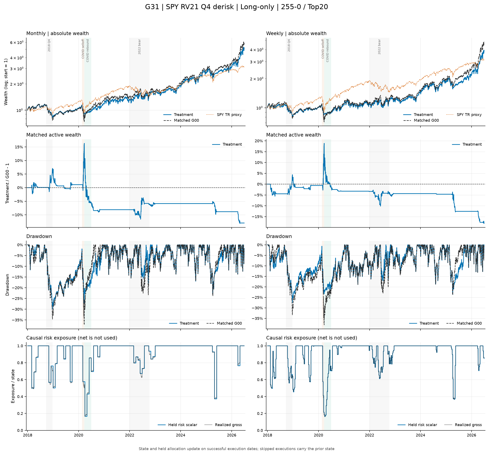
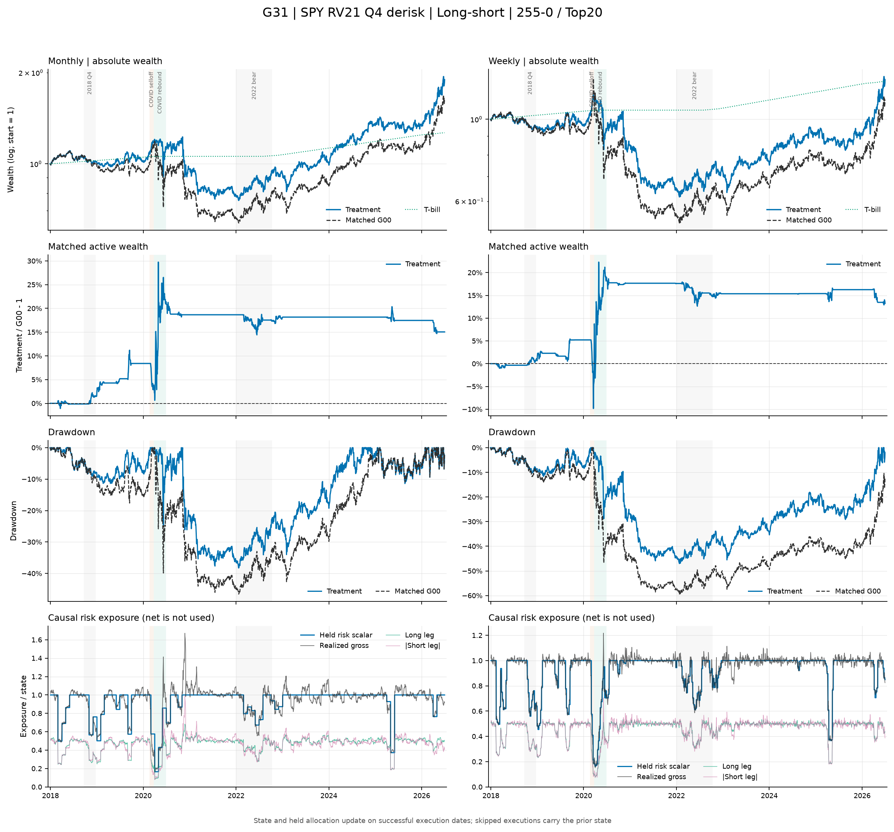

# G31：SPY 历史波动率严格 Q4 减仓——结果报告

状态：**已完成；long-only 最大回撤稳定改善，但预注册 H1 失败；long-short/WML 机制为正，绝对表现仍弱。** 本报告只对应冻结数据 v3 与不可变运行 `g31-frozen-v3-v1`。

## 一句话结论

严格 Q4 减仓确实降低了风险：18/18 个 long-only 主场景的最大回撤都优于 G00，平均改善 10.64 个百分点，年化波动下降 3.43 个百分点，beta 从 1.16 降至 0.91。但保险代价过高：18/18 个场景 CAGR 都下降，只有 2/18 同时改善 Sharpe 与回撤，周频为 0/9，配对 Sharpe 变化中位数为 -0.040。因此 G31 只能记为“回撤有效、风险调整收益平台失败”，不能围绕两个局部月频点宣称成功。

## 主场景曲线诊断

下图只使用冻结 completed bundle 的 **primary 主成本场景**（月频 5bps、周频 10bps；long-short 年化借券费 1%）。主动财富为严格同键的 `G31 / G00 - 1`；long-short 面板中的 SPY 只作市场环境背景，不是同风险基准。

图表是 completed bundle 上的只读诊断，用于观察路径和暴露，不改变预注册假设、门槛或正式判定。

## 运行与审计有效性

本次运行使用本地 runtime 的冻结数据和 G00 参考包，未向 OneDrive 写入大型结果。运行包含 36 条核心策略、72 条完整事件路径、288 个成本/借券场景和 1,440 行同场景 G00 比较。所有场景均覆盖 2018-01-02 至 2026-06-30 的 2,134 个 XNYS 交易日。

产物验收为 0 项失败：9 个 bundle 文件齐全，manifest 中 8 个非 manifest 文件的大小和 SHA256 全部一致；614,592 行 NAV 均为正且有限，日收益复算最大误差为 `4.441e-16`；动态仓位、long/short/gross/net、现金、L1 成本和持仓缩放均在机器精度内闭合。G00 全树指纹在运行前后保持 `32832d1ac0dea2822539803962eab86f426288d0c59e16dbb5a55d7187c1ae20`，没有被 G31 修改。

严格状态与冻结锚点也全部一致：评价期 Q4 为 580/2,134 日；周频 122/444 个信号减仓，平均/最低仓位为 0.9235/0.1640；月频 26/102，平均/最低为 0.9245/0.1657。G31 与 G21 的 499 个共同信号状态逐位相同，2020-02-21 收盘进入 Q4，2020-02-24 开盘执行。

## 主场景汇总

周频采用双边 10bps，月频 5bps；long-short 另计 1% 年化借券费。表中变化均为配对的 `G31 - G00`。

| 模式 | G00 CAGR | G31 CAGR | 变化 | G00 Sharpe | G31 Sharpe | 变化 | G00 MDD | G31 MDD | 回撤变化 |
|---|---:|---:|---:|---:|---:|---:|---:|---:|---:|
| Long-only | 18.87% | 16.31% | -2.56pp | 0.645 | 0.607 | -0.038 | -40.87% | -30.23% | +10.64pp |
| Long-short | 3.04% | 4.07% | +1.03pp | 0.108 | 0.151 | +0.043 | -48.13% | -41.49% | +6.65pp |

Long-only 年化波动由 29.04% 降至 25.61%，年化 L1 换手由 11.56 降至 11.31；这不是通过增加交易换来的回撤改善。Long-short 年化波动由 19.45% 降至 17.23%，换手由 12.02 降至 11.47。

## 预注册 H1 判定

H1 要求 long-only 至少 12/18 个主场景同时改善 Sharpe 与 MDD，周频、月频各至少 5/9，并且两项配对变化中位数都严格为正。

| 模式/频率 | CAGR 改善 | Sharpe 改善 | MDD 改善 | Sharpe + MDD | 三项同时改善 |
|---|---:|---:|---:|---:|---:|
| LO 全体 | 0/18 | 2/18 | 18/18 | 2/18 | 0/18 |
| LO 周频 | 0/9 | 0/9 | 9/9 | 0/9 | 0/9 |
| LO 月频 | 0/9 | 2/9 | 9/9 | 2/9 | 0/9 |
| LS 全体 | 17/18 | 16/18 | 18/18 | 16/18 | 16/18 |
| LS 周频 | 8/9 | 7/9 | 9/9 | 7/9 | 7/9 |
| LS 月频 | 9/9 | 9/9 | 9/9 | 9/9 | 9/9 |

Long-only 的配对变化中位数为：CAGR -2.41pp、Sharpe -0.0396、MDD +10.30pp。只有 `mom_12_1 / Top10 / monthly` 和 `mom_255_21 / Top10 / monthly` 同时小幅改善 Sharpe 与 MDD，Sharpe 增量分别只有 0.0017 和 0.0063，而且 CAGR 仍下降 1.42pp 和 1.00pp。这两个点不能改写平台失败结论。

## 信号、宽度与频率

| 维度 | 组 | G31 CAGR / 变化 | G31 Sharpe / 变化 | G31 MDD / 变化 |
|---|---|---:|---:|---:|
| 信号 | `mom_255_0` | 16.97% / -2.39pp | 0.632 / -0.032 | -31.38% / +9.70pp |
| 信号 | `mom_255_21` | 15.31% / -2.61pp | 0.575 / -0.042 | -30.95% / +11.76pp |
| 信号 | `mom_12_1` | 16.64% / -2.69pp | 0.613 / -0.040 | -28.36% / +10.47pp |
| 宽度 | Top10 | 18.46% / -2.36pp | 0.616 / -0.028 | -37.19% / +10.68pp |
| 宽度 | Top20 | 17.80% / -2.75pp | 0.655 / -0.036 | -28.86% / +10.17pp |
| 宽度 | Top50 | 12.68% / -2.58pp | 0.549 / -0.051 | -24.63% / +11.09pp |
| 频率 | 周频 | 14.82% / -3.14pp | 0.561 / -0.058 | -28.88% / +11.83pp |
| 频率 | 月频 | 17.80% / -1.99pp | 0.652 / -0.018 | -31.57% / +9.46pp |

所有信号、宽度和频率分组都表现为“回撤改善、CAGR 和 Sharpe 平台性下降”。月频的收益代价较小，但仍达不到预注册平台门槛。

## Q4 持有期诊断

以下为主场景按路径汇总的 Q4 下一持有期收益。减仓没有改变股票排序，只按冻结比例缩放两腿，因此左尾改善来自风险敞口下降，而不是买入不同股票。

| 模式/频率 | 来源 | 均值 | ES10 | 最差持有期 |
|---|---|---:|---:|---:|
| LO 周频 | G00 | 0.52% | -8.54% | -14.79% |
| LO 周频 | G31 | 0.28% | -6.22% | -12.08% |
| LO 月频 | G00 | 2.70% | -17.23% | -20.78% |
| LO 月频 | G31 | 1.86% | -11.34% | -12.39% |
| LS 周频 | G00 | 0.02% | -7.62% | -23.69% |
| LS 周频 | G31 | 0.06% | -5.45% | -20.31% |
| LS 月频 | G00 | 0.43% | -8.94% | -14.85% |
| LS 月频 | G31 | 0.69% | -3.85% | -4.51% |

G31 稳定压缩了 Q4 左尾，但 long-only 同时削弱了仍为正的 Q4 平均收益。这与全样本“回撤改善、Sharpe 下降”一致。

## 固定危机窗口

| 窗口 | 模式 | G00 收益 → G31 | G00 MDD → G31 | 解释 |
|---|---|---:|---:|---|
| 2018 Q4 | LO | -29.46% → -24.57% | -30.77% → -25.99% | 有效减损 |
| 2018 Q4 | LS | -3.27% → -2.28% | -7.59% → -5.95% | 小幅改善 |
| COVID 下跌 | LO | -37.00% → -24.20% | -37.83% → -25.20% | 主要保护来源 |
| COVID 下跌 | LS | +12.60% → +6.91% | -3.82% → -2.00% | 风险下降但少赚 |
| COVID 反弹 | LO | +39.77% → +11.88% | -9.07% → -4.88% | 错失反弹，收益代价最大 |
| COVID 反弹 | LS | -20.19% → -9.26% | -36.23% → -24.32% | 明显减损 |
| 2022 熊市 | LO | +1.01% → +2.40% | -23.23% → -18.12% | 收益和回撤均改善 |
| 2022 熊市 | LS | +14.93% → +13.50% | -13.91% → -11.78% | 少赚但回撤改善 |

COVID 下跌期 22/24 个交易日处于 Q4，平均/最低公式仓位约 45.69%/18.17%；反弹期仍有 68/69 日处于 Q4，平均/最低约 54.86%/16.24%。连续 Q4 episode 从 2020-02-21 延续至 2020-06-01，并在 2020-06-03 至 2020-07-10 再次进入。规则在下跌期平均保护 12.80pp，却在反弹窗口平均少赚 27.89pp，这是 CAGR 和 Sharpe 代价的核心路径，不是交易成本导致。

## 成本、借券与可投资性

- 即使交易成本为 0bps，long-only 平均 CAGR 和 Sharpe 相对 G00 仍下降 2.62pp 和 0.034，只有 2/18 同时改善 Sharpe 与 MDD；H1 失败不是成本造成的。
- Long-short 在 1% 借券费下，成本从 0bps 升至 20bps 时平均 CAGR 从 5.04% 降至 2.67%，Sharpe 从 0.207 降至 0.071；相对 G00 的三项机制改善仍有 16/18。
- 在频率对应主成本下，long-short 借券费从 0% 升至 3% 时，平均 CAGR 从 4.55% 降至 3.13%，Sharpe 从 0.179 降至 0.096，MDD 从 -40.89% 恶化至 -42.71%。机制增量为正不等于绝对策略可投资。

SPY 总回报代理的全样本 CAGR、Sharpe、MDD 分别为 14.62%、0.662 和 -33.72%。18 个 long-only 主场景中，12 个 CAGR 超过 SPY，3 个 MDD 小于 25%，但 0 个 Sharpe 超过 1；**没有任何场景同时通过 `CAGR > SPY、Sharpe > 1、MDD < 25%` 的部署联合门槛。**

## 判定与下一步

1. G31 long-only 保留为“部分风险改善、预注册 H1 失败”的完整结果，不围绕两个 Top10 月频点做事后寻优。
2. G31 long-short/WML 证明严格 Q4 同比例缩放能改善价差风险，但平均 Sharpe 仅 0.151、MDD 仍为 -41.49%，只作为机制证据。
3. 下一步按冻结九宫格推进 G32、G33：保持减仓动作不变，只替换为动量组合历史波动率和预测波动率，检验问题来自 SPY RV21 的识别滞后还是动作本身。
4. q85/q90/q95、确认/退出滞后或仓位下限必须另行预注册；不得用它们覆盖 G31 的失败结论。

## 审计边界

完整运行可验证每日 NAV、long/short/cash 余额、敞口、持仓、交易、成本、借券费与公司行动会计。9,828 个主调仓事件中有 9,763 次执行、49 次等待冻结公司行动、16 次 signed missing-open 整本跳过；所有跳过均为零换手、零成本并在后续恢复。没有 terminal liquidation。

当前 artifact 没有逐日 winner、loser、风险资产和 T-bill 的流量式 P&L 贡献表；`long_value`、`short_value`、`cash_value` 是余额，不能直接差分冒充腿贡献。因此本报告不作未经支持的逐腿 P&L 归因声明，这一诊断若要完成，必须新增引擎级 attribution artifact 并使用新的不可变 run。

数据仍为 `review / free_research_candidate`，基准是 SPY 总回报代理，`formal_run_eligible=false`。完整 bundle 位于本地 runtime 的 `results/experiments/G31/runs/g31-frozen-v3-v1/`；Git 只发布 summary、comparison、resolved config 与 manifest。

## 图表附录

全部 primary 路径按频率分面，供逐策略检查：

- [Long-only 月频 atlas](../../figures/round1/G31/atlas-long-only-monthly.png)
- [Long-only 周频 atlas](../../figures/round1/G31/atlas-long-only-weekly.png)
- [Long-short 月频 atlas](../../figures/round1/G31/atlas-long-short-monthly.png)
- [Long-short 周频 atlas](../../figures/round1/G31/atlas-long-short-weekly.png)
