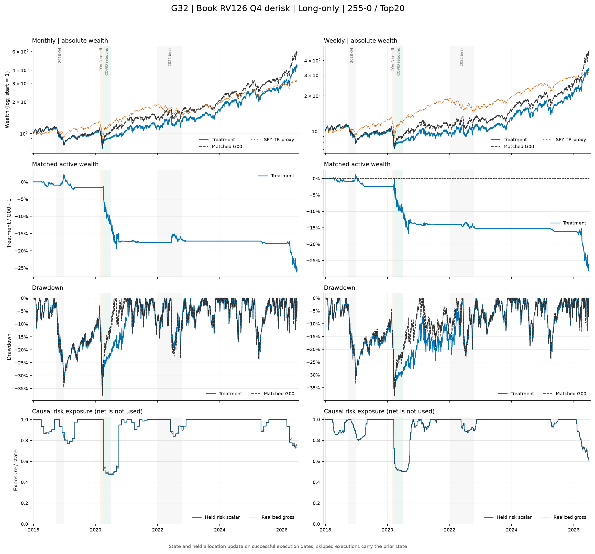
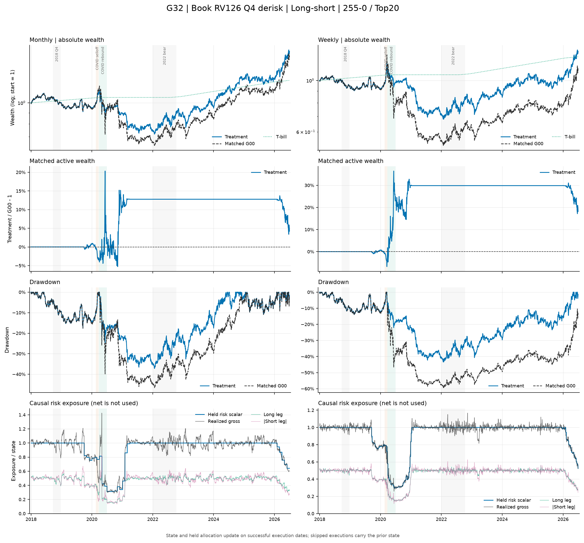

# G32：裸账簿历史波动率严格 Q4 减仓——结果报告

状态：**已完成；运行与会计审计有效，但预注册 long-only H1 明确失败。** 本报告只对应冻结数据 v3 与不可变运行 `g32-frozen-v3-v1`；G00 是唯一正式对照，G31 只用于同动作、不同风险源的解释。

## 一句话结论

裸账簿 RV126 能压缩 Q4 持有期左尾，但没有形成 long-only 跨参数平台：18 个主场景中 **0/18** 同时改善 T-bill 超额 Sharpe 与最大回撤，Sharpe 改善为 **0/18**，MDD 改善为 **11/18**；配对变化中位数为 Sharpe `-0.1198`、MDD `+0.251pp`。平均 CAGR 从 G00 的 18.87% 降至 14.29%。机制失败主要来自识别时点不对称：long-only 在 COVID 下跌期进入过晚，却在 69 个反弹交易日中 18/18 条路径全程处于 Q4。G32 不能替代 G31，也不能在 G33 完成前把失败最终归因于减仓动作本身。

## 主场景曲线诊断

下图只使用冻结 completed bundle 的 **primary 主成本场景**（月频 5bps、周频 10bps；long-short 年化借券费 1%）。主动财富为严格同键的 `G32 / G00 - 1`；long-short 面板中的 SPY 只作市场环境背景，不是同风险基准。

图表是 completed bundle 上的只读诊断，用于观察路径和暴露，不改变预注册假设、门槛或正式判定。

## 运行与审计有效性

本次本地运行包含 36 条核心路径、72 条完整正式事件路径、288 个成本/借券费场景、36 个主场景和 1,440 行同场景 G00 比较。Long-only/long-short 分别为 72/216 个报告场景；全部场景覆盖 2018-01-02 至 2026-06-30 的 2,134 个 XNYS 交易日。

- G32 manifest SHA256 为 `0d85979a75ed02d9033fa3977e06585483e5ca9e3235049d23ac0bdfc5b1cb2d`；manifest 中 8 个文件的字节数与 SHA256 全部复核一致。
- G00 锚为 `g00-frozen-v3-v1` / `8b875d4bcbb7b178b309c7b1edaa7dce9bbb15090e68b619fb045cec35411c66`；G31 解释锚为 `g31-frozen-v3-v1` / `fe38a31017473487db11188b7c9b858d4c54298be674a52d6bb81031bd3b06fc`。
- 614,592 行 NAV 均为正且有限，最小 NAV 为 `0.47074649`；日收益由 NAV 复算的最大误差为 `4.441e-16`。
- 9,828 个主调仓事件中有 9,763 次执行、49 次 `skipped_pending_corporate_action`、16 次 `skipped_signed_missing_open`。所有跳过均为零 L1 换手、零成本；没有 terminal liquidation。
- 36 个主场景合计记录 217 个已应用公司行动事件、600 次估值回退（涉及 127 个 SID 计数）和 100 个未填充执行计数；这些事件均保留在正式审计字段中，没有因缺价删除场景。
- 裸账簿日度状态为 36 × 3,018 = 108,648 行，完整保留 2014-06-30 至 2026-06-30 的因果 warm-up 与评价期状态。

因此该 bundle 可用于本次原型研究的经济判定；但数据 manifest 仍是 `review / free_research_candidate`，且 `formal_run_eligible=false`，不能称为正式可部署结果。

## 主场景汇总

下表是各模式 18 个主场景的算术平均；周频成本 10bps、月频成本 5bps，long-short 借券费 1%。

| 模式 | 来源 | CAGR | T-bill 超额 Sharpe | MDD | 年化波动 | beta | 年化 L1 换手 |
|---|---|---:|---:|---:|---:|---:|---:|
| Long-only | G00 | 18.87% | 0.645 | -40.87% | 29.04% | 1.157 | 11.56 |
| Long-only | G31 | 16.31% | 0.607 | -30.23% | 25.61% | 0.905 | 11.31 |
| Long-only | G32 | 14.29% | 0.526 | -40.42% | 26.93% | 1.059 | 10.91 |
| Long-short | G00 | 3.04% | 0.108 | -48.13% | 19.45% | -0.064 | 12.02 |
| Long-short | G31 | 4.07% | 0.151 | -41.49% | 17.23% | -0.023 | 11.47 |
| Long-short | G32 | 4.39% | 0.179 | -36.22% | 15.33% | -0.034 | 11.13 |

相对 G00，G32 long-only 平均 CAGR/Sharpe/MDD 变化为 `-4.58pp / -0.1190 / +0.45pp`；风险虽下降约 2.11pp 波动和 0.098 beta，却没有换来稳定回撤改善。Long-short 的同三项变化为 `+1.35pp / +0.0705 / +11.91pp`，但平均 Sharpe 仍只有 0.179，属于机制证据而非可投资结论。

## 预注册 H1 判定

H1 要求 long-only 至少 12/18 个主场景同时改善 Sharpe 与 MDD，周频、月频各至少 5/9，并且两项 delta 的全体中位数均严格为正。

| 范围 | CAGR 改善 | Sharpe 改善 | MDD 改善 | Sharpe + MDD | ΔCAGR 中位 | ΔSharpe 中位 | ΔMDD 中位 |
|---|---:|---:|---:|---:|---:|---:|---:|
| LO 全体 | 0/18 | 0/18 | 11/18 | **0/18** | -4.630pp | -0.1198 | +0.251pp |
| LO 周频 | 0/9 | 0/9 | 9/9 | **0/9** | -4.676pp | -0.1233 | +1.315pp |
| LO 月频 | 0/9 | 0/9 | 2/9 | **0/9** | -4.583pp | -0.1134 | -0.437pp |

所有预注册层级都失败；不能用周频 MDD 的局部改善、long-short 的正结果或相对 G31 的差值改写 H1。

按冻结的信号、宽度和频率分组，结论也一致：

| 维度 | 组 | G32 CAGR / ΔG00 | G32 Sharpe / ΔG00 | G32 MDD / ΔG00 |
|---|---|---:|---:|---:|
| 信号 | `mom_12_1` | 14.46% / -4.88pp | 0.527 / -0.125 | -38.21% / +0.62pp |
| 信号 | `mom_255_0` | 15.12% / -4.24pp | 0.555 / -0.109 | -40.92% / +0.16pp |
| 信号 | `mom_255_21` | 13.30% / -4.63pp | 0.496 / -0.122 | -42.14% / +0.56pp |
| 宽度 | Top10 | 15.83% / -4.98pp | 0.535 / -0.108 | -47.31% / +0.55pp |
| 宽度 | Top20 | 15.67% / -4.87pp | 0.572 / -0.119 | -38.82% / +0.21pp |
| 宽度 | Top50 | 11.37% / -3.89pp | 0.471 / -0.129 | -35.13% / +0.58pp |
| 频率 | 周频 | 13.16% / -4.79pp | 0.493 / -0.126 | -39.43% / +1.29pp |
| 频率 | 月频 | 15.42% / -4.37pp | 0.559 / -0.112 | -41.42% / -0.39pp |

## 与 G31 的风险源解释

以下差值均为匹配主场景的 `G32 - G31`。正式 H1 仍只认 G00。

| 模式/频率 | ΔCAGR | ΔSharpe | ΔMDD | Δ年化波动 | Δbeta | 指标为正的路径数（CAGR/Sharpe/MDD） |
|---|---:|---:|---:|---:|---:|---:|
| LO 月频 | -2.380pp | -0.0933 | -9.845pp | +1.459pp | +0.146 | 0/0/0 of 9 |
| LO 周频 | -1.654pp | -0.0681 | -10.544pp | +1.188pp | +0.161 | 0/0/0 of 9 |
| LS 月频 | -0.248pp | +0.0052 | +5.279pp | -2.177pp | -0.005 | 5/5/8 of 9 |
| LS 周频 | +0.903pp | +0.0499 | +5.252pp | -1.619pp | -0.017 | 8/8/9 of 9 |

裸账簿风险源在 long-only 上严格劣于 G31：18/18 的 CAGR、Sharpe 和 MDD 都更差，同时波动和 beta 都更高。Long-short 则相反，尤其周频明显优于 G31；这说明风险源与组合模式存在强交互，不能把 WML 结果外推到 long-only。

两种风险源在共同计划信号上的状态重合很低：

| 模式/频率 | 信号路径行 | 同为 Q4 | 仅 G31 Q4 | 仅 G32 Q4 | 均非 Q4 | allocation 相关 |
|---|---:|---:|---:|---:|---:|---:|
| LO 月频 | 918 | 157 | 77 | 207 | 477 | 0.433 |
| LO 周频 | 3,996 | 702 | 396 | 949 | 1,949 | 0.415 |
| LS 月频 | 918 | 64 | 170 | 148 | 536 | 0.086 |
| LS 周频 | 3,996 | 343 | 755 | 569 | 2,329 | 0.142 |

逐路径 allocation 相关的范围为：LO 月频 0.421–0.444、LO 周频 0.397–0.435、LS 月频 0.013–0.160、LS 周频 0.061–0.226。G32 不是 G31 的轻微改写，而是在大量日期上识别了不同状态。

## Q1–Q4 非重叠持有期

每条主路径按信号日 G32 状态分组；持有期收益使用本次成功执行的 `postcost_nav` 到下一计划执行前 `pretrade_nav`，只有 `executed*` 且有下一期的事件进入统计。表中箭头为 `G00 → G32`，ES 使用最差的 `ceil(10% × n)` 或 `ceil(5% × n)` 个事件均值。

| 模式/频率 | Q | n | 均值 | 中位 | 胜率 | ES10 | ES5 | 最差 |
|---|---:|---:|---:|---:|---:|---:|---:|---:|
| LO/月 | Q1 | 155 | 1.50%→1.50% | 1.32%→1.32% | 57.42%→57.42% | -7.79%→-7.79% | -8.48%→-8.48% | -10.24%→-10.24% |
| LO/月 | Q2 | 180 | 1.01%→1.01% | 1.38%→1.38% | 58.33%→58.33% | -10.41%→-10.41% | -13.85%→-13.85% | -28.38%→-28.38% |
| LO/月 | Q3 | 219 | 0.38%→0.38% | 0.27%→0.27% | 52.97%→52.97% | -15.03%→-15.03% | -18.43%→-18.43% | -22.46%→-22.46% |
| LO/月 | Q4 | 355 | 3.02%→2.16% | 3.03%→2.09% | 67.89%→68.17% | -10.92%→-9.87% | -15.75%→-14.23% | -22.09%→-21.59% |
| LO/周 | Q1 | 648 | 0.35%→0.35% | 0.50%→0.50% | 56.79%→56.79% | -4.59%→-4.59% | -5.46%→-5.46% | -7.32%→-7.32% |
| LO/周 | Q2 | 812 | 0.14%→0.14% | 0.65%→0.65% | 59.36%→59.36% | -7.59%→-7.59% | -9.09%→-9.09% | -13.26%→-13.26% |
| LO/周 | Q3 | 884 | -0.11%→-0.11% | 0.02%→0.02% | 50.11%→50.11% | -8.76%→-8.76% | -11.23%→-11.23% | -16.74%→-16.74% |
| LO/周 | Q4 | 1,638 | 0.84%→0.63% | 0.81%→0.68% | 61.05%→61.11% | -6.90%→-6.11% | -8.80%→-8.01% | -16.66%→-16.13% |
| LS/月 | Q1 | 186 | 0.75%→0.75% | 0.73%→0.73% | 61.29%→61.29% | -5.85%→-5.85% | -6.85%→-6.85% | -8.36%→-8.36% |
| LS/月 | Q2 | 307 | 0.72%→0.72% | 0.63%→0.63% | 55.70%→55.70% | -6.11%→-6.11% | -7.17%→-7.17% | -10.32%→-10.32% |
| LS/月 | Q3 | 211 | 0.26%→0.26% | 0.28%→0.28% | 51.66%→51.66% | -5.84%→-5.84% | -7.15%→-7.15% | -17.48%→-17.48% |
| LS/月 | Q4 | 203 | -0.08%→0.24% | -0.33%→-0.16% | 48.77%→48.77% | -15.24%→-8.88% | -18.38%→-11.19% | -26.77%→-23.25% |
| LS/周 | Q1 | 735 | 0.19%→0.19% | 0.19%→0.19% | 54.01%→54.01% | -2.73%→-2.73% | -3.24%→-3.24% | -4.72%→-4.72% |
| LS/周 | Q2 | 1,327 | 0.02%→0.02% | 0.06%→0.06% | 52.52%→52.52% | -3.54%→-3.54% | -4.53%→-4.53% | -8.53%→-8.53% |
| LS/周 | Q3 | 984 | 0.12%→0.12% | 0.10%→0.10% | 52.13%→52.13% | -4.23%→-4.23% | -5.40%→-5.40% | -7.99%→-7.99% |
| LS/周 | Q4 | 883 | -0.03%→0.09% | 0.02%→0.02% | 50.28%→50.62% | -8.41%→-4.82% | -11.57%→-6.60% | -28.85%→-12.93% |

Q4 减仓确实压缩了四类路径的 ES10/ES5；但 long-only 的 Q4 原始平均收益为正，减仓同时削弱均值。Long-short 的 Q4 原始均值接近或低于零，缩放同时改善均值和左尾，因此两种模式出现相反的全样本结论。Q1–Q3 保持 1 倍仓位，配对结果在报告精度内相同。

未进入持有期表的执行审计为：long-only 周频 5 次等待公司行动；long-short 月频 2 次 signed missing-open；long-short 周频 44 次等待公司行动和 14 次 signed missing-open；另有每条路径最后一期没有下一计划 NAV。

### Q4 持有期 P&L 差值归因

为纳入当次调仓成本并保持逐日闭合，以下归因使用与上表相同的成功执行 Q4 事件集合，但日度区间定义为“本次执行日到下一计划执行日前一交易日”；跳过事件和没有下一计划执行的末期事件仍排除。各组件先在每条路径的非重叠区间内按初始 NAV=1 的金额单位累计，再对同模式、同频率的 9 条主路径取算术平均。表中全部数值为 `G32 - G00`；它们是累计 P&L 金额差，不是上表复合持有期收益率的直接相减。

| 模式/频率 | Q4 成功事件 | 归因路径日 | Δ总 P&L | Δlong | Δshort | ΔT-bill | Δ成本贡献 | Δ借券费贡献 | Δ行动/执行桥 |
|---|---:|---:|---:|---:|---:|---:|---:|---:|---:|
| LO/月 | 355 | 7,486 | -0.847296 | -0.853665 | 0 | +0.013113 | +0.004169 | 0 | -0.010913 |
| LO/周 | 1,638 | 7,904 | -0.981037 | -0.997883 | 0 | +0.013421 | +0.016463 | 0 | -0.013038 |
| LS/月 | 203 | 4,249 | +0.094582 | -0.112456 | +0.178815 | +0.002225 | +0.001999 | +0.003067 | +0.020932 |
| LS/周 | 883 | 4,247 | +0.176798 | -0.097302 | +0.252011 | +0.003012 | +0.006851 | +0.002367 | +0.009858 |

成本和借券费组件本身以负数入账，因此正的差值表示 G32 相对 G00 少付。G32 的桥列合并持久化的 action/execution bridge 与仅为浮点噪声的 unexplained bridge；G00 用同一余额流量公式只读复算桥。G00 主场景全部 172 个绝对值大于 `1e-12` 的实质桥行都落在 G32 标记的冻结证据日；其余桥值只是数值噪声。使用未四舍五入数值时，四行“组件差之和减 Δ总 P&L”的最大绝对误差为 `1.110e-16`。

## Q4 强度与 episode

正式评价期的日度状态分布如下。由于阈值来自滚动历史且波动具有结构变化，Q4 占比不必等于 25%。

| 模式/频率 | Q1 | Q2 | Q3 | Q4 |
|---|---:|---:|---:|---:|
| LO 月频 | 16.34% | 19.97% | 23.38% | **40.31%** |
| LO 周频 | 16.21% | 20.12% | 22.03% | **41.64%** |
| LS 月频 | 19.59% | 33.61% | 23.10% | 23.70% |
| LS 周频 | 18.29% | 34.08% | 24.83% | 22.81% |

| 模式/频率 | Q4 路径日 | σ/q75 均值 | 中位 | P90 | 最大 | a 均值 | 中位 | P10 | 最小 |
|---|---:|---:|---:|---:|---:|---:|---:|---:|---:|
| LO 月频 | 7,741 | 1.283 | 1.140 | 2.007 | 2.426 | 0.824 | 0.877 | 0.498 | 0.412 |
| LO 周频 | 7,998 | 1.261 | 1.127 | 1.949 | 2.402 | 0.835 | 0.887 | 0.513 | 0.416 |
| LS 月频 | 4,551 | 1.811 | 1.485 | 2.943 | 3.375 | 0.640 | 0.673 | 0.340 | 0.296 |
| LS 周频 | 4,381 | 1.775 | 1.457 | 2.787 | 3.507 | 0.648 | 0.686 | 0.359 | 0.285 |

| 模式/频率 | episodes | 中位长度 | 平均长度 | P90 | 最大长度 | 最长 episode |
|---|---:|---:|---:|---:|---:|---|
| LO 月频 | 153 | 19 | 50.6 | 139 | 156 | 2020-03-09 至 2020-10-16 |
| LO 周频 | 130 | 48.5 | 61.5 | 146 | 161 | 2018-02-08 至 2018-09-27 |
| LS 月频 | 48 | 8 | 94.8 | 379 | 393 | 2019-08-14 至 2021-03-05 |
| LS 周频 | 34 | 102 | 128.9 | 372.1 | 395 | 2019-08-26 至 2021-03-19 |

最重要的机制事实不是单日缩放强度，而是状态持续性。Long-only 周频的一条最长 episode 恰在 2018 Q4 抛售前结束；long-short 多条路径从 2019 年持续减仓到 2021 年一季度。RV126 配合 756 日历史分位数会把一次波动抬升转化成很长的风险状态，这既能压缩左尾，也会跨越下跌后的反弹。

## 固定危机窗口

下表为每种模式 18 条主路径的均值，格式是 `累计收益 / MDD`。

| 窗口 | 模式 | G00 | G31 | G32 |
|---|---|---:|---:|---:|
| 2018 Q4 | LO | -29.46% / -30.77% | -24.57% / -25.99% | -27.63% / -28.95% |
| 2018 Q4 | LS | -3.27% / -7.59% | -2.28% / -5.95% | -3.27% / -7.59% |
| COVID 下跌 | LO | -37.00% / -37.83% | -24.20% / -25.20% | -36.06% / -36.90% |
| COVID 下跌 | LS | +12.60% / -3.82% | +6.91% / -2.00% | +10.36% / -3.09% |
| COVID 反弹 | LO | +39.77% / -9.07% | +11.88% / -4.88% | +22.43% / -6.52% |
| COVID 反弹 | LS | -20.19% / -36.23% | -9.26% / -24.32% | -12.23% / -20.64% |
| 2022 熊市 | LO | +1.01% / -23.23% | +2.40% / -18.12% | +0.89% / -22.09% |
| 2022 熊市 | LS | +14.93% / -13.91% | +13.50% / -11.78% | +14.93% / -13.91% |

以下风险与交易指标把 G00 和 G32 并排列示；每个单元格仍是对应模式 18 条主路径的算术平均。L1 换手为窗口内执行日的双边权重变化之和。

| 窗口 | 模式 | 来源 | 年化波动 | 最差日 | beta | L1 换手 |
|---|---|---|---:|---:|---:|---:|
| 2018 Q4 | LO | G00 | 29.84% | -5.17% | 1.248 | 3.46 |
| 2018 Q4 | LO | G32 | 28.53% | -5.16% | 1.184 | 3.32 |
| 2018 Q4 | LS | G00 | 10.79% | -1.65% | 0.089 | 3.34 |
| 2018 Q4 | LS | G32 | 10.79% | -1.65% | 0.089 | 3.34 |
| COVID 下跌 | LO | G00 | 83.74% | -13.18% | 1.091 | 1.27 |
| COVID 下跌 | LO | G32 | 81.49% | -12.96% | 1.062 | 1.30 |
| COVID 下跌 | LS | G00 | 24.35% | -2.32% | 0.014 | 1.36 |
| COVID 下跌 | LS | G32 | 20.14% | -1.90% | 0.011 | 1.08 |
| COVID 反弹 | LO | G00 | 41.47% | -5.11% | 0.988 | 3.97 |
| COVID 反弹 | LO | G32 | 27.22% | -3.31% | 0.627 | 2.25 |
| COVID 反弹 | LS | G00 | 50.60% | -8.84% | -0.536 | 4.57 |
| COVID 反弹 | LS | G32 | 26.75% | -5.02% | -0.270 | 2.74 |
| 2022 熊市 | LO | G00 | 33.42% | -8.66% | 0.892 | 8.37 |
| 2022 熊市 | LO | G32 | 32.07% | -8.66% | 0.865 | 8.18 |
| 2022 熊市 | LS | G00 | 19.62% | -3.79% | -0.268 | 9.44 |
| 2022 熊市 | LS | G32 | 19.62% | -3.79% | -0.268 | 9.44 |

`a` 和 Q4 状态属于 G32 的风险动作，对未缩放的 G00 不适用。下表因此只列 G32；`Q4 日`和`Q4 信号`为每条路径的均值，括号内为路径范围，`a` 使用窗口内日度公式状态。

| 窗口 | 模式 | 平均/最低 a | Q4 日 | Q4 信号 |
|---|---|---:|---:|---:|
| 2018 Q4 | LO | 0.940 / 0.807 | 42.2（30–57）/65 | 5.44（1–12） |
| 2018 Q4 | LS | 1.000 / 1.000 | 0/65 | 0 |
| COVID 下跌 | LO | 0.860 / 0.504 | 11.0（10–12）/24 | 1.00（0–2） |
| COVID 下跌 | LS | 0.807 / 0.532 | 23.1（13–24）/24 | 2.83（1–5） |
| COVID 反弹 | LO | 0.472 / 0.412 | 69/69 | 9.00（4–14） |
| COVID 反弹 | LS | 0.507 / 0.285 | 68.4（59–69）/69 | 8.94（3–14） |
| 2022 熊市 | LO | 0.959 / 0.832 | 99.9（78–112）/196 | 12.44（4–22） |
| 2022 熊市 | LS | 1.000 / 1.000 | 0/196 | 0 |

风险源进入时点解释了结果：

- 2018 Q4：G31 周频从 2018-10-12 进入，G32 long-only 最早在 2018-09-21 进入、10 月中旬后才逐步覆盖全部路径；G32 long-short 整个窗口没有 Q4。
- COVID 下跌：G31 周频于 2020-02-21 进入、月频于 2020-02-28 进入；G32 long-only 周频直到 2020-03-13 才有全部模式中的首批 Q4 信号，月频在下跌窗口没有 Q4。G32 因此只比 G00 少跌 0.94pp，远小于 G31 的 12.80pp。
- COVID 反弹：G32 long-only 18/18 路径、69/69 日均处于 Q4，平均公式仓位只有 47.2%，相对 G00 少赚 17.35pp。Long-short 的缩放则把反弹期损失改善 7.95pp。
- 2022 熊市：G31 周/月分别从 2022-02-04/02-28 进入；G32 long-only 到 2022-05-13/05-31 才进入，long-short 全窗口不进入。G32 long-short 因而与 G00 逐位相同。

四个窗口没有支持“更快、更准的 long-only 自身风险识别”。它在真正下跌早期过慢，在反弹期和部分非危机阶段又过久。

## 危机窗口 P&L 归因

下表把 G00 与 G32 各日组件相对窗口前一日 NAV 的贡献并排列示，按对应模式 18 条主路径取均值；使用未四舍五入值时，各行组件和在机器精度内等于窗口累计收益。G32 使用 NAV artifact 的持久化组件；G00 用同一余额流量公式只读复算。`short` 是空头风险腿 P&L，成本与借券费以负数显示。

| 窗口 | 模式 | 来源 | 总 P&L | long | short | T-bill | 成本 | 借券费 | 行动/执行桥 |
|---|---|---|---:|---:|---:|---:|---:|---:|---:|
| 2018 Q4 | LO | G00 | -29.456% | -30.037% | 0 | +0.000% | -0.250% | 0 | +0.831% |
| 2018 Q4 | LO | G32 | -27.631% | -28.164% | 0 | +0.026% | -0.241% | 0 | +0.749% |
| 2018 Q4 | LS | G00 | -3.274% | -16.294% | +12.364% | +0.642% | -0.271% | -0.124% | +0.409% |
| 2018 Q4 | LS | G32 | -3.274% | -16.294% | +12.364% | +0.642% | -0.271% | -0.124% | +0.409% |
| COVID 下跌 | LO | G00 | -37.002% | -36.915% | 0 | 0 | -0.086% | 0 | 0 |
| COVID 下跌 | LO | G32 | -36.062% | -35.979% | 0 | +0.007% | -0.089% | 0 | 0 |
| COVID 下跌 | LS | G00 | +12.600% | -21.763% | +34.287% | +0.246% | -0.127% | -0.042% | 0 |
| COVID 下跌 | LS | G32 | +10.355% | -17.832% | +28.077% | +0.245% | -0.100% | -0.034% | 0 |
| COVID 反弹 | LO | G00 | +39.771% | +38.979% | 0 | 0 | -0.418% | 0 | +1.210% |
| COVID 反弹 | LO | G32 | +22.426% | +22.137% | 0 | +0.014% | -0.206% | 0 | +0.482% |
| COVID 反弹 | LS | G00 | -20.187% | +15.476% | -35.697% | +0.058% | -0.326% | -0.130% | +0.433% |
| COVID 反弹 | LS | G32 | -12.235% | +10.749% | -22.974% | +0.058% | -0.200% | -0.077% | +0.209% |
| 2022 熊市 | LO | G00 | +1.010% | +0.308% | 0 | +0.000% | -0.696% | 0 | +1.398% |
| 2022 熊市 | LO | G32 | +0.889% | +0.199% | 0 | +0.042% | -0.680% | 0 | +1.328% |
| 2022 熊市 | LS | G00 | +14.931% | +1.442% | +13.353% | +0.559% | -0.815% | -0.403% | +0.795% |
| 2022 熊市 | LS | G32 | +14.931% | +1.442% | +13.353% | +0.559% | -0.815% | -0.403% | +0.795% |

相对 G00 的总收益差主要来自风险腿，而不是现金或成本：2018 Q4 LO `+1.825pp`、COVID 下跌 LO `+0.940pp`、COVID 反弹 LO `-17.345pp`、2022 LO `-0.121pp`。COVID 下跌 LS 的 `-2.244pp` 来自 long 腿改善 `+3.932pp` 但 short 腿少赚 `-6.210pp`；反弹 LS 的 `+7.952pp` 主要来自 short 腿改善 `+12.723pp`，抵消 long 腿 `-4.727pp`。

## P&L 闭合与 action bridge 审计

G32 为全部 288 个场景持久化了逐日 `long / short / T-bill / transaction cost / borrow fee / action-execution / unexplained` 组件。

- 614,592 行中，组件和与 `pnl_total` 的最大误差、`pnl_attributed` 与总 P&L 的最大误差、存储闭合误差均为 `1.735e-18`；`pnl_total` 与逐日 NAV 差分完全一致。
- 288 个场景的 diagnostics 汇总与逐日组件复算最大差为 `4.441e-16`。
- `pnl_unexplained_bridge` 最大绝对值为 `1.606e-15`、全表和为 `-5.925e-12`，只是浮点噪声，低于冻结的 `1e-10` fail-closed 门槛。
- 全部场景有 1,672 个实质非零（绝对值大于 `1e-15`）action/execution bridge 行，且没有任何实质非零值落在无冻结证据的日期。主场景共有 172 个实质非零桥行、18 个唯一日期；18/18 日期都能一一匹配冻结公司行动 ledger，没有 terminal liquidation。最大主场景日桥金额为 `0.070319` NAV 单位。

主场景全样本的平均归因如下，金额以初始 NAV=1 为单位：

| 模式 | 总 P&L | long | short | T-bill | 成本 | 借券费 | action/execution bridge |
|---|---:|---:|---:|---:|---:|---:|---:|
| LO | +2.15825 | +2.18245 | 0 | +0.01415 | -0.08779 | 0 | +0.04944 |
| LS | +0.45032 | +0.73875 | -0.39749 | +0.23590 | -0.07214 | -0.03735 | -0.01735 |

审计边界：action/execution bridge 是在具有冻结公司行动、估值回退或 terminal 证据的日期上承接余额式归因残差的桶，不是独立的逐证券因果收益估计。本次所有实质非零桥都落在公司行动日，因此可以称为“有冻结事件支持且逐日闭合”，但不能把该桶进一步解释成某一并购条款的超额收益。

## 成本与借券压力

Long-only 在每个成本档位都无法通过 H1；即使交易成本为零，18 个路径中仍是 0 个同时改善 Sharpe 与 MDD。

| 成本 | G32 CAGR | Sharpe | MDD | ΔG00 CAGR | ΔG00 Sharpe | ΔG00 MDD | Sharpe+MDD |
|---:|---:|---:|---:|---:|---:|---:|---:|
| 0bps | 15.32% | 0.560 | -39.66% | -4.69pp | -0.118 | +0.50pp | 0/18 |
| 5bps | 14.69% | 0.539 | -40.11% | -4.63pp | -0.119 | +0.49pp | 0/18 |
| 10bps | 14.07% | 0.519 | -40.59% | -4.56pp | -0.119 | +0.46pp | 0/18 |
| 20bps | 12.83% | 0.477 | -41.58% | -4.44pp | -0.120 | +0.44pp | 0/18 |

在 long-short 1% 借券费下，成本升高会压低绝对表现，但相对 G00 的机制增量仍稳定为正：

| 成本 | CAGR | Sharpe | MDD | ΔG00 CAGR | ΔG00 Sharpe | ΔG00 MDD |
|---:|---:|---:|---:|---:|---:|---:|
| 0bps | 5.35% | 0.240 | -35.04% | +1.29pp | +0.080 | +11.93pp |
| 5bps | 4.77% | 0.203 | -35.75% | +1.33pp | +0.074 | +11.93pp |
| 10bps | 4.19% | 0.165 | -36.49% | +1.37pp | +0.068 | +11.93pp |
| 20bps | 3.04% | 0.091 | -38.02% | +1.44pp | +0.057 | +11.86pp |

按周 10bps/月 5bps 的主成本固定后，借券费压力为：

| 年借券费 | CAGR | Sharpe | MDD | 年化 L1 换手 | 总成本 | 总借券费 |
|---:|---:|---:|---:|---:|---:|---:|
| 0% | 4.87% | 0.210 | -35.67% | 11.13 | 0.0735 | 0 |
| 1% | 4.39% | 0.179 | -36.22% | 11.13 | 0.0721 | 0.0374 |
| 3% | 3.46% | 0.117 | -37.36% | 11.14 | 0.0695 | 0.1068 |

因此 long-only 失败不是交易成本造成；long-short 的机制虽抗成本，但绝对 Sharpe 与回撤仍不支持部署，而且免费数据没有逐券真实借券费、可借量或召回。

## 数值部署门槛

冻结 SPY 总回报代理 CAGR 为 14.621%。18 个 G32 long-only 主场景中，9 个 CAGR 严格超过 SPY，**0 个** Sharpe 严格超过 1，**0 个** MDD 严格优于 -25%，联合通过为 **0/18**。

| 路径 | CAGR | > SPY | Sharpe | > 1 | MDD | > -25% | 联合 |
|---|---:|:---:|---:|:---:|---:|:---:|:---:|
| `mom_12_1/top10/monthly` | 17.37% | 是 | 0.572 | 否 | -46.01% | 否 | 否 |
| `mom_12_1/top10/weekly` | 17.55% | 是 | 0.586 | 否 | -38.39% | 否 | 否 |
| `mom_12_1/top20/monthly` | 14.63% | 是 | 0.532 | 否 | -39.51% | 否 | 否 |
| `mom_12_1/top20/weekly` | 14.95% | 是 | 0.551 | 否 | -37.04% | 否 | 否 |
| `mom_12_1/top50/monthly` | 12.21% | 否 | 0.498 | 否 | -36.09% | 否 | 否 |
| `mom_12_1/top50/weekly` | 10.04% | 否 | 0.422 | 否 | -32.19% | 否 | 否 |
| `mom_255_0/top10/monthly` | 19.14% | 是 | 0.624 | 否 | -51.42% | 否 | 否 |
| `mom_255_0/top10/weekly` | 13.83% | 否 | 0.486 | 否 | -45.97% | 否 | 否 |
| `mom_255_0/top20/monthly` | 19.18% | 是 | 0.683 | 否 | -37.73% | 否 | 否 |
| `mom_255_0/top20/weekly` | 15.70% | 是 | 0.585 | 否 | -37.64% | 否 | 否 |
| `mom_255_0/top50/monthly` | 13.35% | 否 | 0.549 | 否 | -36.68% | 否 | 否 |
| `mom_255_0/top50/weekly` | 9.53% | 否 | 0.404 | 否 | -36.09% | 否 | 否 |
| `mom_255_21/top10/monthly` | 15.04% | 是 | 0.509 | 否 | -49.36% | 否 | 否 |
| `mom_255_21/top10/weekly` | 12.06% | 否 | 0.432 | 否 | -52.72% | 否 | 否 |
| `mom_255_21/top20/monthly` | 15.61% | 是 | 0.563 | 否 | -40.90% | 否 | 否 |
| `mom_255_21/top20/weekly` | 13.95% | 否 | 0.517 | 否 | -40.10% | 否 | 否 |
| `mom_255_21/top50/monthly` | 12.27% | 否 | 0.502 | 否 | -35.07% | 否 | 否 |
| `mom_255_21/top50/weekly` | 10.83% | 否 | 0.451 | 否 | -34.69% | 否 | 否 |

即使某个单点通过数值门槛也不等于平台成立；本次没有单点通过。容量没有机构级成交量、冲击模型和借券可用量支持，不能给出可信部署容量数字。

## 36 个主场景的 G32 - G31 五指标

| 路径 | ΔCAGR(pp) | ΔSharpe | ΔMDD(pp) | ΔVol(pp) | ΔBeta |
|---|---:|---:|---:|---:|---:|
| `mom_12_1__top10__monthly__long_only` | -3.453 | -0.1060 | -11.976 | +1.466 | +0.1651 |
| `mom_12_1__top10__monthly__long_short` | -0.570 | -0.0160 | +7.095 | -2.376 | -0.0035 |
| `mom_12_1__top10__weekly__long_only` | -2.737 | -0.0851 | -7.055 | +1.001 | +0.1785 |
| `mom_12_1__top10__weekly__long_short` | -0.042 | -0.0055 | +3.063 | -1.801 | -0.0179 |
| `mom_12_1__top20__monthly__long_only` | -2.501 | -0.0948 | -9.394 | +1.339 | +0.1486 |
| `mom_12_1__top20__monthly__long_short` | +0.376 | +0.0344 | +10.167 | -2.699 | -0.0037 |
| `mom_12_1__top20__weekly__long_only` | -1.808 | -0.0733 | -11.300 | +1.158 | +0.1632 |
| `mom_12_1__top20__weekly__long_short` | +0.571 | +0.0323 | +5.294 | -1.802 | -0.0181 |
| `mom_12_1__top50__monthly__long_only` | -1.464 | -0.0870 | -10.007 | +1.881 | +0.1429 |
| `mom_12_1__top50__monthly__long_short` | +0.784 | +0.0733 | +8.706 | -1.969 | -0.0008 |
| `mom_12_1__top50__weekly__long_only` | -1.130 | -0.0676 | -9.334 | +1.615 | +0.1510 |
| `mom_12_1__top50__weekly__long_short` | +1.027 | +0.0712 | +6.285 | -1.483 | -0.0135 |
| `mom_255_0__top10__monthly__long_only` | -2.667 | -0.0837 | -9.997 | +1.123 | +0.1491 |
| `mom_255_0__top10__monthly__long_short` | -2.438 | -0.1181 | -7.151 | -2.009 | -0.0102 |
| `mom_255_0__top10__weekly__long_only` | -1.421 | -0.0446 | -7.477 | +0.611 | +0.1581 |
| `mom_255_0__top10__weekly__long_short` | +1.154 | +0.0441 | +5.395 | -1.294 | -0.0373 |
| `mom_255_0__top20__monthly__long_only` | -2.270 | -0.0898 | -7.674 | +1.068 | +0.1328 |
| `mom_255_0__top20__monthly__long_short` | -1.248 | -0.0506 | +1.076 | -1.955 | -0.0128 |
| `mom_255_0__top20__weekly__long_only` | -1.864 | -0.0732 | -10.108 | +0.775 | +0.1461 |
| `mom_255_0__top20__weekly__long_short` | +0.523 | +0.0239 | +3.581 | -1.615 | -0.0288 |
| `mom_255_0__top50__monthly__long_only` | -1.618 | -0.0965 | -9.207 | +1.706 | +0.1328 |
| `mom_255_0__top50__monthly__long_short` | +0.189 | +0.0281 | +4.675 | -1.790 | -0.0065 |
| `mom_255_0__top50__weekly__long_only` | -1.264 | -0.0719 | -12.801 | +1.428 | +0.1416 |
| `mom_255_0__top50__weekly__long_short` | +1.006 | +0.0610 | +5.756 | -1.343 | -0.0206 |
| `mom_255_21__top10__monthly__long_only` | -3.870 | -0.1143 | -11.326 | +1.383 | +0.1577 |
| `mom_255_21__top10__monthly__long_short` | -0.495 | -0.0199 | +6.088 | -2.213 | -0.0038 |
| `mom_255_21__top10__weekly__long_only` | -1.590 | -0.0503 | -12.918 | +1.125 | +0.1864 |
| `mom_255_21__top10__weekly__long_short` | +1.213 | +0.0438 | +5.149 | -1.815 | -0.0022 |
| `mom_255_21__top20__monthly__long_only` | -2.362 | -0.0918 | -9.332 | +1.358 | +0.1485 |
| `mom_255_21__top20__monthly__long_short` | +0.647 | +0.0633 | +9.190 | -2.600 | +0.0009 |
| `mom_255_21__top20__weekly__long_only` | -1.940 | -0.0772 | -11.932 | +1.247 | +0.1669 |
| `mom_255_21__top20__weekly__long_short` | +1.341 | +0.0786 | +4.802 | -1.763 | -0.0125 |
| `mom_255_21__top50__monthly__long_only` | -1.215 | -0.0761 | -9.688 | +1.806 | +0.1390 |
| `mom_255_21__top50__monthly__long_short` | +0.526 | +0.0526 | +7.661 | -1.985 | -0.0013 |
| `mom_255_21__top50__weekly__long_only` | -1.136 | -0.0701 | -11.972 | +1.731 | +0.1577 |
| `mom_255_21__top50__weekly__long_short` | +1.339 | +0.0995 | +7.947 | -1.654 | -0.0063 |

## 判定与下一步

1. G32 long-only 记为“Q4 左尾局部改善、预注册 H1 与部署门槛失败”；不得围绕周频 MDD、某个 Top/K 或 long-short 结果做事后改写。
2. G32 long-short 保留为正向机制证据：自身风险源对 WML 的持续高波动识别优于 G31，但绝对 Sharpe、回撤、借券和容量仍不支持部署。
3. G31 与 G32 的 long-only 都失败，说明两个已冻结历史风险源均未解决严格 Q4 动作的收益代价；按预注册顺序必须完成 G33 的因果 EWMA 预测风险源后，才能进一步区分“历史风险源滞后”与“动作本身不合适”。
4. q85/q90/q95、确认/退出滞后、仓位下限、不同 RV 窗口或不同缩放函数只能另行预注册；不得覆盖本运行。

## 审计边界

- 本报告的正式绩效只来自 completed G32/G00 bundles；G31 只进入风险源解释。
- 危机表是 18 条路径的算术平均，不是一个可交易的“策略组合”；窗口是冻结的描述性切片，不构成额外通过门槛。
- G00 危机逐腿贡献按与 G32 相同的余额流量公式只读复算；G32 逐日组件已持久化在 NAV artifact。两者均未改变 bundle。
- 数据是免费研究候选，SPY 是总回报代理而非官方 S&P 500 Total Return；借券费、可借量、冲击和容量均非机构级输入。
- 完整大产物只位于本地 runtime；本报告不复制 NAV、裸账簿状态、持仓或交易到 Git/OneDrive。

## 图表附录

全部 primary 路径按频率分面，供逐策略检查：

- [Long-only 月频 atlas](../../figures/round1/G32/atlas-long-only-monthly.png)
- [Long-only 周频 atlas](../../figures/round1/G32/atlas-long-only-weekly.png)
- [Long-short 月频 atlas](../../figures/round1/G32/atlas-long-short-monthly.png)
- [Long-short 周频 atlas](../../figures/round1/G32/atlas-long-short-weekly.png)
