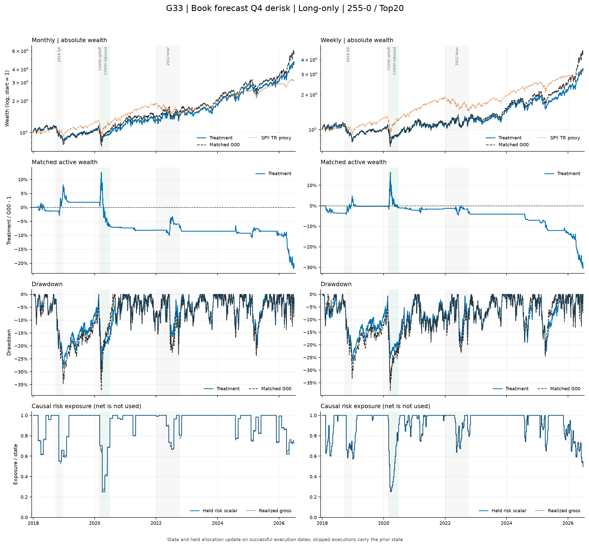
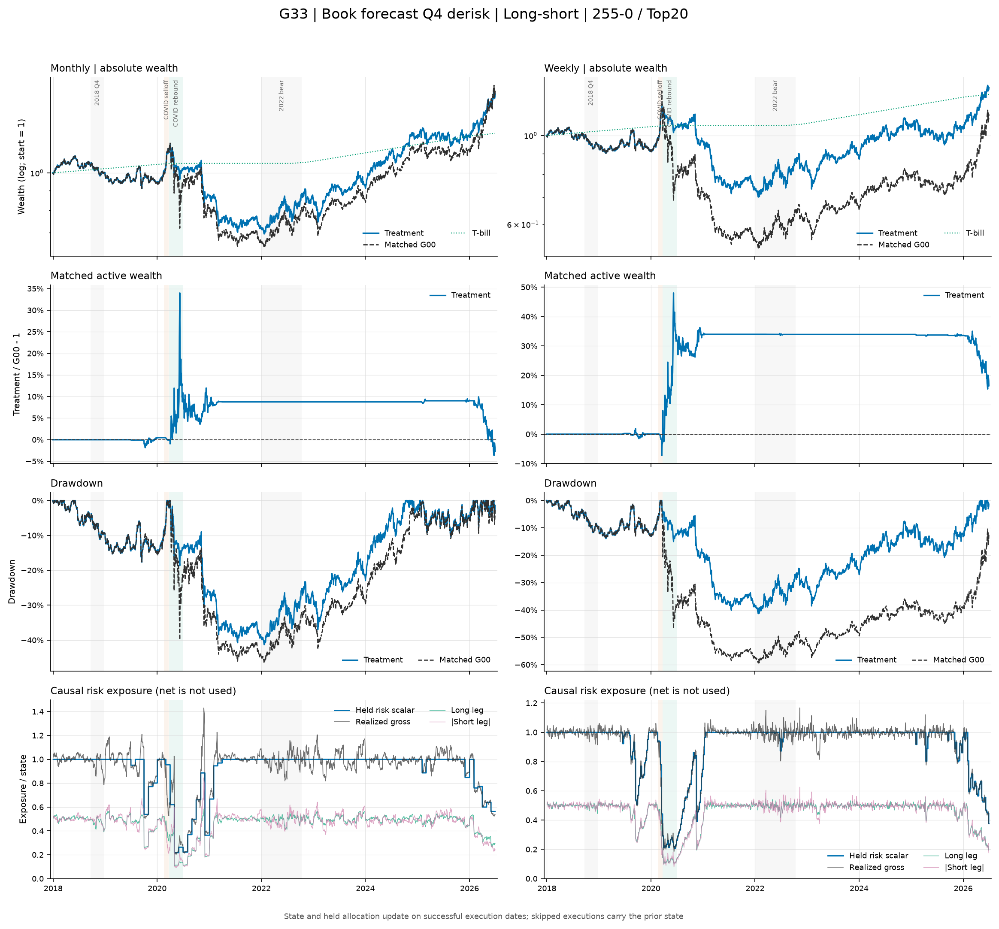

# G33：裸账簿 EWMA 预测波动率严格 Q4 减仓——结果报告

状态：**已完成；运行、因果性与会计审计有效，但预注册 long-only H1 明确失败。** 本报告只对应冻结数据 v3 与不可变运行 g33-frozen-v3-v1。G00 是唯一正式对照；G31/G32 只在 G33 完成后进入风险源解释，不是本次运行输入。

## 一句话结论

因果 EWMA 风险源把 long-only 的最大回撤在 18/18 个主场景中压低，但 CAGR 与 T-bill 超额 Sharpe 也在 18/18 个场景下降，Sharpe 与 MDD 同时改善为 **0/18**，预注册 H1 因而失败。保护主要发生在 2018 Q4 和 COVID 下跌；COVID 反弹期月/周频 long-only 相对 G00 少赚约 24.5/25.8 个百分点，保险成本超过左尾收益。Long-short 有 10/18 个主场景同时改善 Sharpe 与 MDD，但全压力网格仅 128/216，且绝对 Sharpe 仍弱。事后同键比较中，G31 的 LO 最好、G32 的 LS 最好；G31/G32/G33 的部署联合通过均为 0。

## 主场景曲线诊断

下图只使用冻结 completed bundle 的 **primary 主成本场景**（月频 5bps、周频 10bps；long-short 年化借券费 1%）。主动财富为严格同键的 `G33 / G00 - 1`；long-short 面板中的 SPY 只作市场环境背景，不是同风险基准。

图表是 completed bundle 上的只读诊断，用于观察路径和暴露，不改变预注册假设、门槛或正式判定。

## 运行与审计有效性

- 运行包含 36 条核心路径、288 个成本/借券场景、36 个主场景和 1,440 行同场景 G00 比较；long-only/long-short 分别为 72/216 个报告场景。
- Manifest SHA256 为 11803b8b934a768075f2aae7ca6830e18848c960775d95db74b3636a91b50259，完整树 SHA256 为 98b01d10c4edd9d0faf2ed8f7f835175ff8fe642ba6c31ded4eaaefc3b8a4c6f。目录恰有 9 个文件，manifest 的 8 条产物记录逐字节、逐 SHA256 复核为零失败。
- G00 正式锚为 g00-frozen-v3-v1 / 8b875d4bcbb7b178b309c7b1edaa7dce9bbb15090e68b619fb045cec35411c66；冻结数据 manifest 为 65b628d604f7e2f456e8d1d43a3c3e88b6bd3e86cc1c9455cdcfe28b856a3ec7。
- 614,592 行 NAV 覆盖每个场景 2,134 个 XNYS 交易日；9,828 行调仓、388,872 行持仓、448,196 行交易与 115,344 行诊断均通过 schema、唯一键和有限值检查。
- 调仓状态为 executed 9,763 次、skipped_pending_corporate_action 49 次、skipped_signed_missing_open 16 次。G33 与 G00 的信号、执行状态、选股 SID 和缺价字段逐位相同；持仓严格等于 G00 目标权重乘同日标量 a，最大误差为 0。
- 36 条裸账簿路径各有 3,018 个预测日。首日收益均非零，v0=r0² 误差为 0；EWMA 直接递推最大误差 8.674e-19，21v 误差为 0，年化预测波动误差 2.220e-16，shift(1) 后 756 日分位数、quartile 与 a 均逐位一致。
- P&L 组件最大闭合误差为 1.735e-18，普通日 unexplained bridge 最大绝对值为 1.416e-15；成本与借券费汇总误差分别不超过 1.110e-16 与 9.714e-17。
- 同 run id 重跑在加载数据前由 FileExistsError 拒绝。运行前后的 G00/G31/G32 整树指纹完全不变。

因此 bundle 可用于本次原型研究的经济判定；但数据仍为 review / free_research_candidate，且 formal_run_eligible=false，不能称为正式或可部署结果。每个场景的完整 63 列指标见 [published summary](../../../results/published/G33/summary.csv)，五项正式差值见 [comparison](../../../results/published/G33/comparison.csv)。

## 主场景汇总

下表为每个模式 18 个主场景的算术平均。周频成本 10bps、月频成本 5bps，long-short 借券费 1%。

| 模式 | 来源 | CAGR | T-bill 超额 Sharpe | MDD | 年化波动 | beta | 年化 L1 |
|---|---|---:|---:|---:|---:|---:|---:|
| Long-only | G00 | 18.87% | 0.645 | -40.87% | 29.04% | 1.157 | 11.56 |
| Long-only | G31 | 16.31% | 0.607 | -30.23% | 25.61% | 0.905 | 11.31 |
| Long-only | G32 | 14.29% | 0.526 | -40.42% | 26.93% | 1.059 | 10.91 |
| Long-only | G33 | **14.55%** | **0.556** | **-31.83%** | **25.00%** | **0.929** | **11.17** |
| Long-short | G00 | 3.04% | 0.108 | -48.13% | 19.45% | -0.064 | 12.02 |
| Long-short | G31 | 4.07% | 0.151 | -41.49% | 17.23% | -0.023 | 11.47 |
| Long-short | G32 | 4.39% | 0.179 | -36.22% | 15.33% | -0.034 | 11.13 |
| Long-short | G33 | **3.50%** | **0.122** | **-38.99%** | **15.32%** | **-0.028** | **11.30** |

相对 G00，G33 long-only 的平均 CAGR/Sharpe/MDD/波动/beta/L1 变化为 -4.325pp / -0.0887 / +9.042pp / -4.042pp / -0.228 / -0.388。Long-short 的对应变化为 +0.456pp / +0.0138 / +9.140pp / -4.129pp / +0.036 / -0.719。

## 预注册 H1 判定

H1 要求 long-only 至少 12/18 个主场景同时满足 ΔSharpe>0 与 ΔMDD>0，周、月各至少 5/9，且全体两项中位数都严格为正。

| 范围 | CAGR 改善 | Sharpe 改善 | MDD 改善 | Sharpe+MDD | ΔCAGR 中位 | ΔSharpe 中位 | ΔMDD 中位 |
|---|---:|---:|---:|---:|---:|---:|---:|
| LO 全体 | 0/18 | 0/18 | 18/18 | **0/18** | -3.944pp | -0.0878 | +7.943pp |
| LO 月频 | 0/9 | 0/9 | 9/9 | **0/9** | -3.493pp | -0.0613 | +7.473pp |
| LO 周频 | 0/9 | 0/9 | 9/9 | **0/9** | -5.355pp | -0.1131 | +11.616pp |
| LS 全体 | 13/18 | 10/18 | 18/18 | 10/18 | +0.337pp | +0.0233 | +7.698pp |

H1 明确失败。所有 long-only 都买到了回撤保护，但所有路径也都付出了 CAGR 和 Sharpe 代价；不能用 long-short、某个危机窗口或相对 G31/G32 的改善重写结论。

| 维度 | 组 | G33 CAGR / ΔG00 | G33 Sharpe / ΔG00 | G33 MDD / ΔG00 | Sharpe+MDD |
|---|---|---:|---:|---:|---:|
| LO 信号 | mom_12_1 | 14.55% / -4.785pp | 0.553 / -0.0990 | -30.41% / +8.424pp | 0/6 |
| LO 信号 | mom_255_0 | 15.36% / -4.003pp | 0.585 / -0.0797 | -32.12% / +8.961pp | 0/6 |
| LO 信号 | mom_255_21 | 13.74% / -4.186pp | 0.530 / -0.0874 | -32.96% / +9.741pp | 0/6 |
| LO 宽度 | Top10 | 15.90% / -4.922pp | 0.550 / -0.0928 | -40.26% / +7.605pp | 0/6 |
| LO 宽度 | Top20 | 15.82% / -4.726pp | 0.599 / -0.0916 | -29.47% / +9.559pp | 0/6 |
| LO 宽度 | Top50 | 11.93% / -3.327pp | 0.519 / -0.0817 | -25.76% / +9.961pp | 0/6 |
| LO 频率 | 月频 | 16.35% / -3.448pp | 0.612 / -0.0592 | -33.76% / +7.273pp | 0/9 |
| LO 频率 | 周频 | 12.75% / -5.201pp | 0.501 / -0.1181 | -29.90% / +10.810pp | 0/9 |
| LS 信号 | mom_12_1 | 3.72% / +0.080pp | 0.132 / -0.0002 | -37.75% / +8.210pp | 2/6 |
| LS 信号 | mom_255_0 | 3.13% / +1.001pp | 0.100 / +0.0316 | -41.54% / +11.528pp | 4/6 |
| LS 信号 | mom_255_21 | 3.64% / +0.287pp | 0.133 / +0.0101 | -37.69% / +7.682pp | 4/6 |
| LS 宽度 | Top10 | 2.69% / +0.314pp | 0.087 / -0.0124 | -46.66% / +8.839pp | 1/6 |
| LS 宽度 | Top20 | 4.46% / +0.321pp | 0.179 / +0.0151 | -39.81% / +9.605pp | 3/6 |
| LS 宽度 | Top50 | 3.33% / +0.733pp | 0.100 / +0.0388 | -30.50% / +8.976pp | 6/6 |

## 三种风险源的事后解释

G31/G32 不是 G33 的运行输入，也不是正式 reference。以下比较在 G33 completed bundle 验收后才生成，只解释风险源，不设替代 H1。

| 模式/频率 | G31 Q4/均值a/最小a | G32 Q4/均值a/最小a | G33 Q4/均值a/最小a | G31-G32 J/r | G31-G33 J/r | G32-G33 J/r |
|---|---:|---:|---:|---:|---:|---:|
| LO 月 | 26.0 / .9245 / .1657 | 40.4 / .9319 / .4518 | 33.1 / .9234 / .2419 | .357/.434 | .519/.785 | .438/.531 |
| LO 周 | 122.0 / .9235 / .1640 | 183.4 / .9316 / .4704 | 155.9 / .9174 / .2355 | .343/.415 | .509/.774 | .484/.535 |
| LS 月 | 26.0 / .9245 / .1657 | 23.6 / .9176 / .3250 | 24.1 / .9207 / .2283 | .168/.085 | .172/.176 | .782/.865 |
| LS 周 | 122.0 / .9235 / .1640 | 101.3 / .9204 / .3356 | 108.4 / .9156 / .2181 | .206/.140 | .257/.295 | .683/.868 |

J 是 Q4 Jaccard，r 是共同信号日 allocation 相关。LO 的 G33 状态更接近 SPY 驱动的 G31；LS 的两个 book 风险源 G32/G33 高度重合。但 G31/G32/G33 的 LO 同时改善数分别只有 2/18、0/18、0/18，状态相似并不等于经济成功。就均值而言，G31 的 LO 最好、G32 的 LS 最好。

## Q1–Q4 非重叠持有期

主场景按信号日 G33 quartile 分组。当前事件须成功执行且存在下一计划调仓；持有期为本次执行后的 postcost NAV 到下一计划调仓前的 pretrade NAV。箭头为 G00→G33，ES 为最差 ceil(10%×n) 或 ceil(5%×n) 个事件的均值。

| 模式/频率 | Q | n | 均值 | 中位 | 胜率 | ES10 | ES5 | 最差 |
|---|---:|---:|---:|---:|---:|---:|---:|---:|
| LO/月 | Q1 | 194 | 1.86%→1.86% | 1.70%→1.70% | 61.86%→61.86% | -7.36%→-7.36% | -8.87%→-8.87% | -12.53%→-12.53% |
| LO/月 | Q2 | 173 | -0.82%→-0.82% | -0.18%→-0.18% | 47.98%→47.98% | -11.72%→-11.72% | -14.75%→-14.75% | -18.92%→-18.92% |
| LO/月 | Q3 | 253 | 1.64%→1.64% | 1.69%→1.69% | 59.29%→59.29% | -7.07%→-7.07% | -8.69%→-8.69% | -22.46%→-22.46% |
| LO/月 | Q4 | 289 | 3.24%→2.29% | 4.30%→2.96% | 68.51%→68.51% | -16.74%→-12.03% | -19.82%→-14.52% | -28.38%→-22.09% |
| LO/周 | Q1 | 789 | 0.27%→0.27% | 0.38%→0.38% | 55.13%→55.13% | -4.65%→-4.65% | -5.63%→-5.63% | -7.66%→-7.66% |
| LO/周 | Q2 | 743 | -0.06%→-0.06% | 0.09%→0.09% | 52.62%→52.62% | -6.54%→-6.54% | -7.87%→-7.87% | -11.85%→-11.85% |
| LO/周 | Q3 | 1,060 | 0.29%→0.29% | 0.61%→0.61% | 59.43%→59.43% | -6.74%→-6.74% | -8.41%→-8.41% | -13.26%→-13.26% |
| LO/周 | Q4 | 1,390 | 0.82%→0.54% | 1.15%→0.90% | 60.22%→60.29% | -8.97%→-7.12% | -11.30%→-9.09% | -16.74%→-14.63% |
| LS/月 | Q1 | 190 | 0.89%→0.89% | 0.84%→0.84% | 61.05%→61.05% | -5.21%→-5.21% | -6.14%→-6.14% | -7.39%→-7.39% |
| LS/月 | Q2 | 310 | 0.28%→0.28% | 0.33%→0.33% | 54.19%→54.19% | -6.71%→-6.71% | -7.56%→-7.56% | -10.32%→-10.32% |
| LS/月 | Q3 | 199 | 1.26%→1.26% | 1.17%→1.17% | 57.29%→57.29% | -4.41%→-4.41% | -5.14%→-5.14% | -6.91%→-6.91% |
| LS/月 | Q4 | 208 | -0.52%→-0.55% | -0.63%→-0.27% | 45.67%→45.67% | -15.59%→-12.11% | -18.71%→-14.32% | -26.77%→-16.74% |
| LS/周 | Q1 | 780 | 0.13%→0.13% | 0.07%→0.07% | 52.31%→52.31% | -2.59%→-2.59% | -3.11%→-3.11% | -6.13%→-6.13% |
| LS/周 | Q2 | 1,253 | 0.08%→0.08% | 0.09%→0.09% | 52.51%→52.51% | -3.52%→-3.52% | -4.55%→-4.55% | -7.99%→-7.99% |
| LS/周 | Q3 | 948 | -0.03%→-0.03% | -0.04%→-0.04% | 49.16%→49.16% | -4.27%→-4.27% | -5.27%→-5.27% | -8.53%→-8.53% |
| LS/周 | Q4 | 948 | 0.08%→0.14% | 0.30%→0.20% | 54.75%→55.06% | -8.25%→-4.32% | -11.34%→-5.77% | -28.85%→-8.47% |

合计 9,727 个有效事件；每条路径最后一期共 36 个事件因没有下一 pretrade NAV 排除。另有 65 个跳过：LO 周频 pending 5 次；LS 月频 signed-missing 2 次；LS 周频 pending 44 次、signed-missing 14 次。跳过事件不启动新状态，完整日期和原因保留在 rebalances artifact。

Q4 的 ES 与最差事件在四类路径中都改善，但 LO 的 Q4 原始均值为正，减仓同步削弱均值；LS 的左尾压缩更容易转化为净收益。

## Q4 强度与 episode

正式评价期的日度 quartile 分布为：

| 模式/频率 | Q1 | Q2 | Q3 | Q4 |
|---|---:|---:|---:|---:|
| LO 月 | 19.76% | 18.59% | 26.14% | 35.51% |
| LO 周 | 19.46% | 18.16% | 26.62% | 35.76% |
| LS 月 | 19.30% | 30.72% | 24.24% | 25.74% |
| LS 周 | 19.32% | 31.37% | 24.29% | 25.01% |

| 模式/频率 | Q4 信号 | σ/q75 均值 | 中位 | P95 | 最大 | a 均值 | 中位 | P05 | 最小 |
|---|---:|---:|---:|---:|---:|---:|---:|---:|---:|
| LO 月 | 298 | 1.423 | 1.277 | 2.589 | 4.513 | .764 | .783 | .386 | .222 |
| LO 周 | 1,403 | 1.412 | 1.277 | 2.236 | 4.836 | .765 | .783 | .447 | .207 |
| LS 月 | 217 | 1.785 | 1.468 | 4.124 | 4.599 | .664 | .681 | .242 | .217 |
| LS 周 | 976 | 1.799 | 1.511 | 3.821 | 4.862 | .654 | .662 | .262 | .206 |

| 模式/频率 | 日度 episodes | 平均长度 | 中位 | P90 | 最大 | 最长 episode |
|---|---:|---:|---:|---:|---:|---|
| LO 月 | 295 | 23.1 | 7 | 82.0 | 163 | 2025-11-04 至 2026-06-30 |
| LO 周 | 308 | 22.3 | 7 | 80.3 | 163 | 2025-11-04 至 2026-06-30 |
| LS 月 | 202 | 24.5 | 5 | 99.5 | 250 | 2020-02-07 至 2021-02-03 |
| LS 周 | 194 | 24.8 | 5 | 98.7 | 234 | 2020-02-10 至 2021-01-12 |

LS 的最长 Q4 episode 跨过 COVID 下跌与反弹并延续到 2021 年，这是左尾改善但绝对收益仍弱的关键路径。Episode 的完整进入/退出日期可由 108,648 行 daily_naked_regime 逐位复现；本文只汇总，不把单一 episode 当作通过门槛。

### Q4 G33-G00 闭合归因

成功执行更新 active state，跳过维持旧状态；从 Q4 执行日含当日累计到下一成功状态变更。若最后一个 Q4 状态没有后续非 Q4 成功变更，则累计至 2026-06-30；因此本表是可逐日闭合的 active-state 归因，不等同于上一节排除末期 36 个事件的 postcost-to-next-pretrade 持有期。每条路径以初始 NAV=1 的金额计量，再对同模式/频率 9 条路径等权平均。成本与借券组件本身为负，正差值表示 G33 少付。

| 模式/频率 | Δ总 P&L | Δlong | Δshort | ΔT-bill | Δ成本 | Δ借券费 | Δ行动/执行桥 |
|---|---:|---:|---:|---:|---:|---:|---:|
| LO 月 | -0.920353 | -0.933873 | 0 | +0.023888 | +0.002671 | 0 | -0.013039 |
| LO 周 | -1.268339 | -1.285493 | 0 | +0.023007 | +0.010461 | 0 | -0.016313 |
| LS 月 | -0.055282 | -0.223895 | +0.150395 | +0.001949 | +0.001418 | +0.003198 | +0.011654 |
| LS 周 | +0.098652 | -0.202390 | +0.285906 | +0.004372 | +0.005420 | +0.002577 | +0.002766 |

未四舍五入时最大闭合误差为 1.33e-15。LO 的保险代价几乎全是放弃 winner-long 收益；T-bill 与成本节省远不足以抵消。LS 周频的改善主要来自减少 loser-short 亏损，被 long 腿收益损失部分抵销。

## EWMA 预测的事后校准

该诊断只在 completed bundle 后计算，不进入信号、参数选择或 H1。信号日 t 的预测 F 为 sqrt(252v_t)，事后结果 Y 为未来 21 日裸账簿平方收益均值年化。Bias=F-Y；mean(y/v) 是逐点 Y²/F² 的均值；coverage=P(Y≤F)；OLS slope 是带截距回归 Y 对 F 的斜率。窗口重叠，因此不报告独立样本 p 值。

| 模式/频率 | n | 预测均值 | 事后均值 | Bias | MAE | RMSE | Pearson | Spearman | mean(y/v) | QLIKE | 覆盖率 | OLS slope |
|---|---:|---:|---:|---:|---:|---:|---:|---:|---:|---:|---:|---:|
| LO 月 | 918 | .2570 | .2619 | -.0048 | .0802 | .1291 | .485 | .590 | 1.371 | .378 | .512 | .570 |
| LO 周 | 3,960 | .2597 | .2599 | -.0002 | .0789 | .1221 | .509 | .579 | 1.345 | .385 | .530 | .583 |
| LS 月 | 918 | .1621 | .1671 | -.0050 | .0512 | .0891 | .626 | .733 | 1.347 | .321 | .480 | .711 |
| LS 周 | 3,960 | .1661 | .1683 | -.0021 | .0467 | .0755 | .701 | .759 | 1.266 | .277 | .521 | .773 |

EWMA 有中等排序信息，但 slope 全部小于 1，预测振幅偏大。LO 的 Q4 预测/事后均值为月频 .3629/.3413、周频 .3587/.3179，而 Q1 为 .1618/.1894、.1648/.1858：高风险端系统性高估、低风险端低估。这会让 LO 减仓过深、退出过晚；“预测有信息”不等于“经济机制成功”。

## 固定危机窗口

箭头为 G00→G33；每行是对应模式/频率 9 条主路径均值。a 与 Q4 日按窗口内逐日日度公式状态计算，Q4 调仓只统计计划信号；三项都只属于 G33。

| 窗口 | 模式/频率 | 累计收益 | 年化波动 | MDD | 最差日 | beta | L1 | G33 日度平均/最低a | 日度Q4日均值[范围] | Q4调仓 |
|---|---|---:|---:|---:|---:|---:|---:|---:|---:|---:|
| 2018Q4 | LO 月 | -29.87%→-24.14% | 30.46%→24.93% | -31.24%→-25.63% | -5.34%→-5.34% | 1.275→.980 | 2.42→2.06 | .707/.533 | 52.11 [52–53] | 2.00 |
| 2018Q4 | LO 周 | -29.05%→-23.36% | 29.22%→22.31% | -30.30%→-24.72% | -5.00%→-4.86% | 1.220→.899 | 4.50→3.79 | .740/.551 | 52.78 [52–56] | 11.00 |
| 2018Q4 | LS 月 | -3.68%→-3.68% | 10.76%→10.76% | -8.11%→-8.11% | -1.70%→-1.70% | .107→.107 | 2.27→2.27 | 1.000/.998 | .11 [0–1] | 0 |
| 2018Q4 | LS 周 | -2.87%→-2.87% | 10.82%→10.82% | -7.07%→-7.07% | -1.61%→-1.61% | .072→.072 | 4.42→4.42 | 1/1 | 0 | 0 |
| COVID跌 | LO 月 | -37.29%→-30.24% | 84.53%→60.83% | -38.04%→-31.08% | -13.36%→-9.38% | 1.100→.787 | .72→.78 | .546/.208 | 21.11 [21–22] | 1.00 |
| COVID跌 | LO 周 | -36.72%→-25.19% | 82.95%→47.32% | -37.61%→-26.25% | -13.00%→-6.58% | 1.082→.591 | 1.82→1.52 | .546/.205 | 21.22 [21–22] | 4.22 |
| COVID跌 | LS 月 | +9.63%→+9.47% | 19.10%→18.83% | -2.58%→-2.56% | -1.45%→-1.42% | .055→.054 | .71→.70 | .794/.495 | 20.11 [16–24] | .67 |
| COVID跌 | LS 周 | +15.56%→+13.72% | 29.60%→21.80% | -5.05%→-2.64% | -3.19%→-1.72% | -.028→-.041 | 2.00→1.52 | .727/.289 | 18.89 [12–24] | 3.56 |
| COVID反弹 | LO 月 | +41.98%→+17.45% | 42.86%→23.07% | -9.51%→-5.66% | -5.19%→-3.39% | 1.039→.525 | 2.68→1.57 | .514/.204 | 69 | 3.00 |
| COVID反弹 | LO 周 | +37.57%→+11.74% | 40.09%→16.10% | -8.64%→-4.16% | -5.02%→-3.94% | .937→.318 | 5.26→2.89 | .542/.199 | 69 | 13.56 |
| COVID反弹 | LS 月 | -13.88%→-8.57% | 51.96%→21.03% | -34.77%→-16.79% | -9.34%→-3.88% | -.505→-.163 | 3.00→1.85 | .367/.163 | 69 | 3.00 |
| COVID反弹 | LS 周 | -26.50%→-8.72% | 49.24%→14.71% | -37.68%→-12.82% | -8.34%→-2.66% | -.567→-.168 | 6.14→2.01 | .297/.196 | 69 | 13.56 |
| 2022熊 | LO 月 | +0.55%→+2.35% | 33.57%→30.52% | -22.79%→-18.11% | -8.77%→-8.17% | .914→.843 | 5.87→5.88 | .916/.573 | 92.67 [62–114] | 5.00 |
| 2022熊 | LO 周 | +1.47%→+0.88% | 33.26%→30.26% | -23.67%→-20.76% | -8.56%→-7.61% | .871→.797 | 10.87→10.95 | .918/.577 | 89.44 [61–113] | 18.00 |
| 2022熊 | LS 月 | +15.96%→+15.99% | 19.06%→19.04% | -13.41%→-13.39% | -3.75%→-3.73% | -.234→-.234 | 6.66→6.65 | .998/.856 | 9.89 [0–26] | .22 |
| 2022熊 | LS 周 | +13.90%→+13.80% | 20.17%→20.04% | -14.41%→-14.43% | -3.83%→-3.71% | -.302→-.300 | 12.23→12.32 | .993/.810 | 20.11 [0–42] | 3.89 |

风险时点解释：

- 2018Q4：G33 LO 月频 2018-11-01 进入，周频多数 2018-10-15 进入；LS 没有 Q4 调仓，月频只出现 1 个路径日的日度 Q4 状态，经济结果在报告精度内与 G00 相同。
- COVID：G33 LO 的日度 Q4 episode 于 2020-02-21 至 02-24 进入、2020-06-30 至 07-08 退出；LS 于 2020-02-05 至 03-09 进入、2021-01-12 至 02-11 退出。G32 进入更迟且更持久；G31 的主要 episode 为 2020-02-21 至 06-01，并在 06-03 至 07-10 再次进入。
- 2022：G33 LO 多数 2022-05-02 才进入，LS 仅稀疏进入，窗口效果因而弱且混合。

### 危机窗口 P&L 差值归因

下表是 G33-G00 的窗口收益贡献差，单位为百分点；按模式/频率 9 条路径等权平均。正成本/借券差表示少付。

| 窗口 | 模式/频率 | Δ总 | Δlong | Δshort | ΔT-bill | Δ成本 | Δ借券 | Δ桥 |
|---|---|---:|---:|---:|---:|---:|---:|---:|
| 2018Q4 | LO 月 | +5.723 | +5.946 | 0 | +0.123 | +0.016 | 0 | -0.361 |
| 2018Q4 | LO 周 | +5.683 | +5.623 | 0 | +0.139 | +0.053 | 0 | -0.132 |
| 2018Q4 | LS 月/周 | 0 | 0 | 0 | 0 | 0 | 0 | 0 |
| COVID跌 | LO 月 | +7.049 | +7.012 | 0 | +0.039 | -0.003 | 0 | 0 |
| COVID跌 | LO 周 | +11.526 | +11.448 | 0 | +0.065 | +0.013 | 0 | 0 |
| COVID跌 | LS 月 | -0.166 | +0.214 | -0.381 | 0 | +0.001 | 0 | 0 |
| COVID跌 | LS 周 | -1.849 | +3.844 | -5.757 | -0.001 | +0.056 | +0.008 | 0 |
| COVID反弹 | LO 月 | -24.522 | -24.016 | 0 | +0.021 | +0.081 | 0 | -0.609 |
| COVID反弹 | LO 周 | -25.824 | -25.196 | 0 | +0.046 | +0.355 | 0 | -1.029 |
| COVID反弹 | LS 月 | +5.305 | -5.203 | +10.599 | 0 | +0.050 | +0.071 | -0.211 |
| COVID反弹 | LS 周 | +17.777 | -9.646 | +27.418 | 0 | +0.323 | +0.080 | -0.398 |
| 2022熊 | LO 月 | +1.804 | +1.870 | 0 | +0.031 | -0.003 | 0 | -0.093 |
| 2022熊 | LO 周 | -0.597 | -0.465 | 0 | +0.025 | -0.006 | 0 | -0.151 |
| 2022熊 | LS 月 | +0.030 | -0.026 | +0.055 | 0 | +0.001 | 0 | 0 |
| 2022熊 | LS 周 | -0.102 | +0.061 | -0.156 | 0 | -0.009 | +0.002 | 0 |

为同时披露 G00 与 G33 的绝对成本、借券及各腿贡献，以下把月/周各 9 条路径合并为每模式 18 条路径均值；单位仍为窗口前 NAV 的百分比贡献。

| 窗口 | 模式 | 来源 | 总 P&L | long | short | T-bill | 成本 | 借券费 | 桥 |
|---|---|---|---:|---:|---:|---:|---:|---:|---:|
| 2018Q4 | LO | G00 | -29.456% | -30.037% | 0 | +0.000% | -0.250% | 0 | +0.831% |
| 2018Q4 | LO | G33 | -23.753% | -24.253% | 0 | +0.131% | -0.216% | 0 | +0.585% |
| 2018Q4 | LS | G00 | -3.274% | -16.294% | +12.364% | +0.642% | -0.271% | -0.124% | +0.409% |
| 2018Q4 | LS | G33 | -3.274% | -16.294% | +12.364% | +0.642% | -0.271% | -0.124% | +0.409% |
| COVID跌 | LO | G00 | -37.002% | -36.915% | 0 | 0 | -0.086% | 0 | 0 |
| COVID跌 | LO | G33 | -27.714% | -27.685% | 0 | +0.052% | -0.081% | 0 | 0 |
| COVID跌 | LS | G00 | +12.600% | -21.763% | +34.287% | +0.246% | -0.127% | -0.042% | 0 |
| COVID跌 | LS | G33 | +11.592% | -19.734% | +31.218% | +0.245% | -0.099% | -0.038% | 0 |
| COVID反弹 | LO | G00 | +39.771% | +38.979% | 0 | 0 | -0.418% | 0 | +1.210% |
| COVID反弹 | LO | G33 | +14.598% | +14.373% | 0 | +0.034% | -0.200% | 0 | +0.391% |
| COVID反弹 | LS | G00 | -20.187% | +15.476% | -35.697% | +0.058% | -0.326% | -0.130% | +0.433% |
| COVID反弹 | LS | G33 | -8.645% | +8.051% | -16.688% | +0.058% | -0.140% | -0.055% | +0.128% |
| 2022熊 | LO | G00 | +1.010% | +0.308% | 0 | +0.000% | -0.696% | 0 | +1.398% |
| 2022熊 | LO | G33 | +1.613% | +1.011% | 0 | +0.028% | -0.701% | 0 | +1.276% |
| 2022熊 | LS | G00 | +14.931% | +1.442% | +13.353% | +0.559% | -0.815% | -0.403% | +0.795% |
| 2022熊 | LS | G33 | +14.894% | +1.459% | +13.302% | +0.559% | -0.819% | -0.402% | +0.795% |

G33 使用持久化 P&L 列；G00 未持久化逐腿列，因此按相同余额流量公式只读重构。Bridge 是有冻结行动/执行证据的闭合残差，不作证券级因果解释。16 个窗口行未四舍五入的最大闭合误差为 2.75e-15。

## 全样本 P&L 闭合

| 模式 | 总 P&L | long | short | T-bill | 成本 | 借券费 | action/execution bridge |
|---|---:|---:|---:|---:|---:|---:|---:|
| LO | +2.22671 | +2.25101 | 0 | +0.02349 | -0.09684 | 0 | +0.04905 |
| LS | +0.34503 | +0.62550 | -0.37398 | +0.22981 | -0.07234 | -0.03649 | -0.02746 |

主场景共有 217 个公司行动事件、600 次估值回退、127 个回退 SID 计数和 100 个未填充执行计数。所有实质 bridge 都有冻结证据，unexplained bridge 仅为浮点噪声。

全部 288 个场景共有 1,672 个绝对 bridge 大于 1e-15 的行；主场景为 172 行、18 个唯一日期，全部满足 pnl_bridge_has_frozen_evidence=1，最大绝对值为 0.077878。没有冻结证据的实质 bridge 为 0。

## 成本与借券压力

Long-only 在所有成本档都是 CAGR 0/18、Sharpe 0/18、MDD 18/18、联合 0/18；失败不是交易成本造成。

| 成本 | CAGR | Sharpe | MDD | ΔCAGR | ΔSharpe | ΔMDD | 联合 |
|---:|---:|---:|---:|---:|---:|---:|---:|
| 0bps | 15.60% | .594 | -31.24% | -4.407pp | -.0841 | +8.923pp | 0/18 |
| 5bps | 14.96% | .571 | -31.61% | -4.358pp | -.0868 | +8.988pp | 0/18 |
| 10bps | 14.32% | .548 | -32.01% | -4.309pp | -.0894 | +9.039pp | 0/18 |
| 20bps | 13.06% | .503 | -32.98% | -4.213pp | -.0947 | +9.041pp | 0/18 |

Long-short 的 12 个成本×借券格如下；联合列是 18 条路径中同时改善 Sharpe 与 MDD 的数量。

| 成本 | 借券 | CAGR | Sharpe | MDD | ΔCAGR | ΔSharpe | ΔMDD | 联合 |
|---:|---:|---:|---:|---:|---:|---:|---:|---:|
| 0 | 0% | 4.94% | .215 | -37.20% | +.359pp | +.0285 | +9.212pp | 14/18 |
| 0 | 1% | 4.46% | .184 | -37.71% | +.401pp | +.0241 | +9.260pp | 14/18 |
| 0 | 3% | 3.52% | .123 | -38.79% | +.483pp | +.0154 | +9.345pp | 10/18 |
| 5 | 0% | 4.35% | .177 | -37.90% | +.393pp | +.0222 | +9.202pp | 12/18 |
| 5 | 1% | 3.87% | .146 | -38.44% | +.434pp | +.0178 | +9.242pp | 10/18 |
| 5 | 3% | 2.94% | .085 | -39.62% | +.516pp | +.0092 | +9.254pp | 10/18 |
| 10 | 0% | 3.76% | .140 | -38.66% | +.426pp | +.0160 | +9.147pp | 10/18 |
| 10 | 1% | 3.29% | .109 | -39.25% | +.467pp | +.0116 | +9.165pp | 10/18 |
| 10 | 3% | 2.36% | .048 | -40.45% | +.548pp | +.0029 | +9.173pp | 10/18 |
| 20 | 0% | 2.60% | .064 | -40.27% | +.491pp | +.0034 | +8.993pp | 10/18 |
| 20 | 1% | 2.13% | .033 | -40.89% | +.532pp | -.0010 | +8.987pp | 10/18 |
| 20 | 3% | 1.21% | -.028 | -42.16% | +.611pp | -.0096 | +9.054pp | 8/18 |

全 216 个 long-short 压力场景中，CAGR 改善 156/216、MDD 改善 216/216、Sharpe 与 MDD 同时改善 128/216。20bps+1% 时平均 ΔSharpe 已转负，故只能称为部分且成本/借券敏感的机制证据。

## 数值部署门槛

冻结 SPY 总回报代理 CAGR 为 14.621%。18 个 LO 主场景中，8 个 CAGR>SPY、0 个 Sharpe>1、2 个 MDD>-25%，联合通过 **0/18**。

| 路径 | CAGR | Sharpe | MDD | >SPY / >1 / >-25% |
|---|---:|---:|---:|---|
| mom_12_1/top10/monthly | 18.32% | .616 | -40.45% | 是 / 否 / 否 |
| mom_12_1/top10/weekly | 16.04% | .563 | -32.39% | 是 / 否 / 否 |
| mom_12_1/top20/monthly | 15.21% | .571 | -32.21% | 是 / 否 / 否 |
| mom_12_1/top20/weekly | 14.30% | .552 | -26.72% | 否 / 否 / 否 |
| mom_12_1/top50/monthly | 13.09% | .562 | -28.09% | 否 / 否 / 否 |
| mom_12_1/top50/weekly | 10.34% | .456 | -22.57% | 否 / 否 / 是 |
| mom_255_0/top10/monthly | 20.11% | .666 | -44.02% | 是 / 否 / 否 |
| mom_255_0/top10/weekly | 12.62% | .460 | -39.53% | 否 / 否 / 否 |
| mom_255_0/top20/monthly | 19.97% | .735 | -28.63% | 是 / 否 / 否 |
| mom_255_0/top20/weekly | 15.29% | .594 | -27.54% | 是 / 否 / 否 |
| mom_255_0/top50/monthly | 14.38% | .620 | -27.97% | 否 / 否 / 否 |
| mom_255_0/top50/weekly | 9.78% | .432 | -25.04% | 否 / 否 / 否 |
| mom_255_21/top10/monthly | 16.80% | .573 | -41.82% | 是 / 否 / 否 |
| mom_255_21/top10/weekly | 11.49% | .424 | -43.34% | 否 / 否 / 否 |
| mom_255_21/top20/monthly | 16.23% | .605 | -33.45% | 是 / 否 / 否 |
| mom_255_21/top20/weekly | 13.91% | .539 | -28.29% | 否 / 否 / 否 |
| mom_255_21/top50/monthly | 13.00% | .558 | -27.19% | 否 / 否 / 否 |
| mom_255_21/top50/weekly | 11.00% | .484 | -23.69% | 否 / 否 / 是 |

三种风险源的联合部署通过数都是 0：G31 为 12/0/3/0，G32 为 9/0/0/0，G33 为 8/0/2/0（依次为 CAGR、Sharpe、MDD、联合）。免费数据、SPY 代理、简化成本与借券输入进一步禁止部署表述。

## 判定与下一步

1. G33 long-only 记为“回撤 18/18 改善，但 CAGR/Sharpe 18/18 下降，保险成本过高，H1 失败”。
2. G33 long-short 只保留为部分机制证据：主场景 10/18、全压力 128/216 同时改善 Sharpe/MDD，绝对 Sharpe 弱且对成本/借券敏感，不能挽救 LO H1。
3. G31/G32/G33 三个严格 Q4 风险源均未使 LO 通过同一 H1。下一冻结阶段是 G11–G13，比较连续缩放与尾部动作的 beta/反弹成本；本文不声称三组内部顺序已冻结，也不启动下一实验。
4. q85/q90/q95、不同 lambda/horizon、确认滞后、仓位下限或新预测器都必须另行预注册，不得覆盖本运行。

## 审计边界

- 正式经济比较只来自 completed G33/G00 bundles；G31/G32 仅作事后解释。
- 事后 21 日 realized volatility 只用于校准，不进入状态、模型选择或通过门槛。
- 危机窗口是冻结的描述性切片；路径均值不是可交易的二级组合。
- G00 逐腿贡献按与 G33 相同的余额流量公式只读重建；bridge 是闭合桶而非证券级因果收益。
- 完整 NAV、预测状态、持仓、交易和诊断只保留在本地 runtime；Git/OneDrive 仅发布 summary、comparison、resolved config、manifest 与本报告。

## 图表附录

全部 primary 路径按频率分面，供逐策略检查：

- [Long-only 月频 atlas](../../figures/round1/G33/atlas-long-only-monthly.png)
- [Long-only 周频 atlas](../../figures/round1/G33/atlas-long-only-weekly.png)
- [Long-short 月频 atlas](../../figures/round1/G33/atlas-long-short-monthly.png)
- [Long-short 周频 atlas](../../figures/round1/G33/atlas-long-short-weekly.png)
