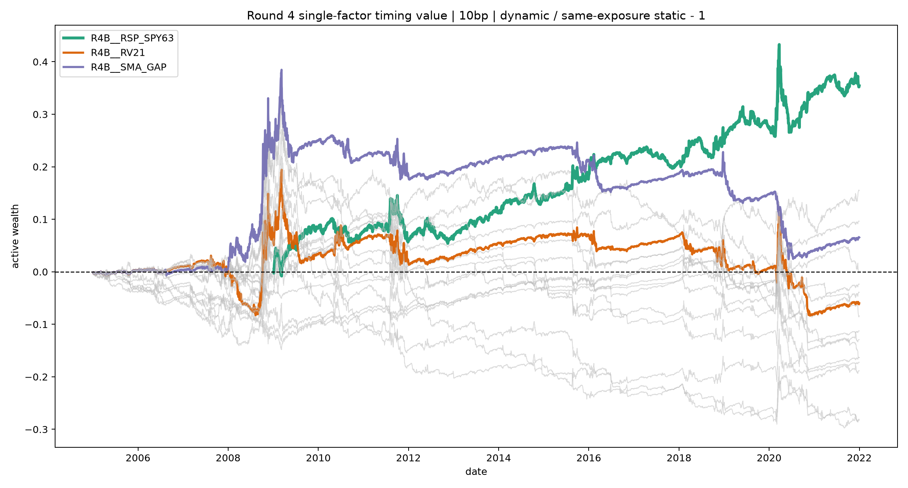

# R4B 原 T2 单因子统一参考报告

结论：17 条可运行因子中，只有 `RSP/SPY 63d` 获得普通 `reference_positive`；没有任何因子获得 `robust_reference_positive`。因此当前仍没有可晋级的防御启动信号，但 participation/breadth 方向值得保留为下一轮候选。

主 bundle：`r4b-t2-single-factor-20260817-v1`；manifest SHA256 `bfbeb494c5abbb2403468b94b9190a75f41638cc418be6e39366952a747cc588`；tree SHA256 `8864f7d5f4f37eccde2355678072bccb3be7588f6804055771e7b2970b58ec96`。全部路径为 2005–2021 development，10bp 主成本，2022+ 未读取。

## 关键结果

| arm | T2 AUC | T1 Spearman | vs同暴露终值 | 正年度 | reference | robust |
|---|---:|---:|---:|---:|---:|---:|
| RSP/SPY63 | 0.511 | -0.0546 | +35.42% | 10/13 | 是 | 否 |
| SMA gap | 0.499 | +0.0243 | +6.54% | 11/17 | 否 | 否 |
| skew63 | 0.493 | -0.0042 | +15.45% | 9/17 | 否 | 否 |
| 10Y–2Y | 0.486 | +0.0061 | +9.62% | 11/17 | 否 | 否 |
| RV21 | 0.488 | +0.0688 | -5.99% | 10/17 | 否 | 否 |
| VIX–RV gap | 0.505 | +0.0497 | -28.29% | 6/17 | 否 | 否 |
| down-volume share | 0.501 | +0.0613 | -28.11% | 4/17 | 否 | 否 |

RSP/SPY63 的 10bp动态路径 CAGR 15.53%、Sharpe 1.115、MDD -22.94%，同平均暴露静态 CAGR 12.86%；0/5/10/20bp 下相对同暴露终值依次为 +40.95/+38.16/+35.42/+30.12%。但 AUC 仅略高于随机，13周block one-sided p=0.0155 经17臂 BH 调整后 q=0.2635，未过10% FDR，且只覆盖 4/10 个大回撤 first-10 前13周。它是线索，不是稳健结论。

共同区间审计从 2009-01-05 起对17臂使用相同677个可评分周；RSP/SPY63仍排名第一。其他因子的共同区间符号明显漂移，进一步否定按单次 native 终值挑冠军。
