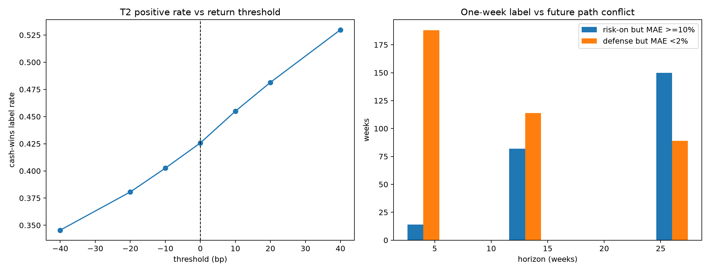

# R4C 原 target sanity-check 报告

结论：`T2=1[T1<0]` 并非因为零阈值稍微设错而失败；更大的问题是它把幅度悬殊的周等权分类，并与“未来季度仍有多少可避免下行”的任务明显错位。

主 bundle manifest SHA256 `d53bdd1baf8a79ecdff9749c1f0c40a1b746bdd03e7bdb2a71053b33aeea2eb5`，tree SHA256 `88740d61379772f2cacac4ed8dae35b78a2329f121dcfcfd196c3435aab1f2dc`。

- 1,508 个成熟一周标签中，cash-wins 比例 42.57%，lag-1 自相关 -0.053，标签本身接近逐周噪声；
- 把阈值从 0 改到 -20bp 只翻转 4.51% 周；改到 +20bp 翻转 5.57%。因此小幅 dead-zone 会清理边界噪声，但不会改变主结论；
- `|T1|<=20bp` 仅占 10.08%；相反，最差四分之一周贡献全部负超额收益金额的 89.77%。二分类丢失幅度信息是更大的缺陷；
- 13周诊断中有 82 周是 `T2=risk-on` 但后续 MAE>=10%，另有114周是 `T2=defense` 但后续 MAE<2%；
- 4/13/26周 terminal 与一周标签的冲突都很高，说明“下周赢现金”和“防季度级左尾”不是同一任务。

Sign oracle 与 worst-25% oracle 证明预测价值上限很高，但它们是不可交易的事后上限。本批不据此改 target，也没有回跑因子。
