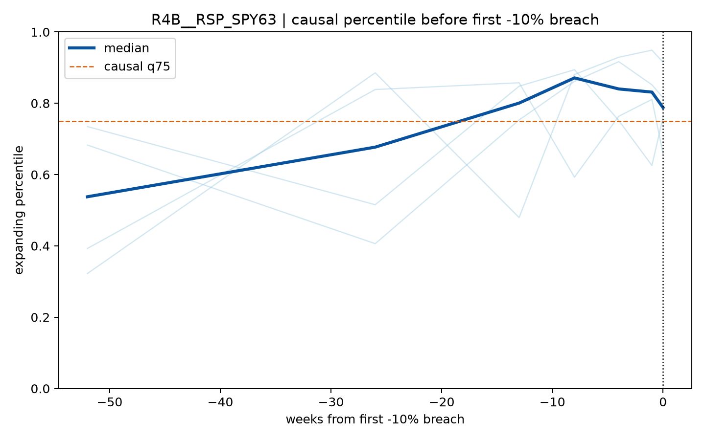

# R4D SPY 大回撤与反例事件图谱报告

机械算法在 1993–2021 得到 30 个至少 -5% episode，其中 -10%/-15%/-20% 分别为 10/5/3 个，与预注册 sanity expectation 完全一致。主事件包括 1997 两次、1998、1999、dot-com、GFC、2015–16、2018两次和COVID；2022 未进入。

因子确实会在部分大回撤前抬升，但没有一个同时做到高覆盖和低误报：RV ratio、down-volume share、VIX–RV gap 在 first-10 前13周覆盖 7/10 个事件，但全期分别产生 278/327/346 个 alert weeks。RSP/SPY63 仅覆盖 4/10，尽管其经济参考最好。这解释了“能感知风险状态”与“能做周度防御决策”之间的差距。

示例：RSP/SPY63 的因果事件轨迹。

完整17张事件图位于 [`docs/figures/round4/event-atlas`](../../figures/round4/event-atlas/)。主 bundle manifest SHA256 `a53bfa0c9d8efa37d1f4c83fd3c7ef6a743f84e58f110161eaab84ce05008229`，tree SHA256 `0fb0b77e69b751f84a4424505434c6d24061eeba5366ff9e58d7124d56f177ff`。
