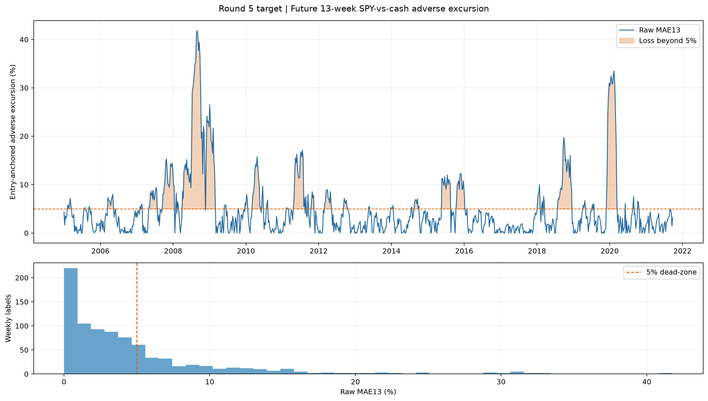

# R5A MAE13 target 报告

状态：`completed_development`；`formal_eligible=false`；锁箱未读取。

完整历史 target bundle 含1,509行，其中1,496行在2022锁箱前成熟；正式2005–2021开发评价为874周。原始MAE13中位数约3.16%，均值约5.00%；33.22%的完整历史周超过5%，开发段为31.01%。5% dead-zone 后约三分之二标签为0，仍保留连续尾部严重度。

标签高度持续，原始MAE13 lag-1自相关约0.936，因此后续推断必须使用13周时间块，不能把周标签视为独立样本。最后成熟signal为2021-09-24、终点为2021-12-27；2022-01-03以后标签值为0个非空。

Bundle manifest SHA256：`1475104c9e7c6eb415500bb29f65ac27cc78736828022058760a526702ef233a`；tree SHA256：`962550e6539f4fde31628a191994e7d99a9e8b4a47ffab548ae02a8a3a1226fa`。
