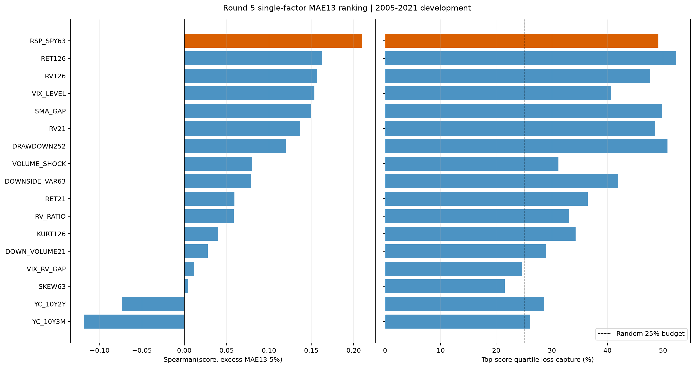

# R5B MAE13 单因子报告

状态：`completed_development`；17条冻结因子全部完成，未新增因子、窗口或模型。

## 核心结果

`RSP/SPY63` participation proxy 是唯一在17项FDR后仍通过主统计门的因子：

- `Spearman(score,Y5)=0.2098`；
- 13周 block 95%单侧下界 `0.0774`；
- 单侧 block `p=0.0040`，BH-FDR `q=0.0680`；
- 最高风险四分位捕获 `49.16%` 的 `sum(Y5)`，相对25%预算 lift约1.97；
- top组平均 `Y5` 为其余周的 `2.89` 倍；
- 对原始MAE13>=10%的lift约 `2.06`。

次强的RET126、RV126、VIX level、SMA gap和RV21均为正向，但FDR后未过0.10；收益率曲线两项方向为负。SMA gap虽未通过统计稳健门，仍进入后续经济代理的普通参考判定。

Bundle manifest SHA256：`cad91aec0bbd78f7944bc536cfd515709fdc94ef2bfb06b00124fa6818d75499`；tree SHA256：`9007ce22b27c134281caa5e08ed54b37a9bab9e64f4add5cb9baeada2625e9b5`。
