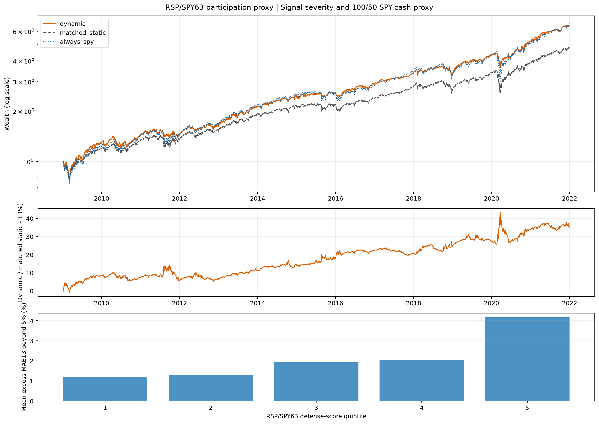

# R5C SPY/cash 统一经济代理报告

状态：`completed_development`；动作固定为q75触发100/50 SPY-cash，主成本10bp。

## RSP/SPY63

RSP/SPY63因数据与260周阈值历史从2009开始正式经济路径。10bp结果：

| 路径 | CAGR | Sharpe | MDD | 终值 |
|---|---:|---:|---:|---:|
| 动态100/50 | 15.53% | 1.115 | -22.94% | 6.516 |
| 同平均暴露静态控制 | 12.86% | 0.908 | -28.14% | 4.812 |
| Always-SPY | 15.66% | 0.905 | -33.70% | 6.613 |

动态相对同暴露控制终值领先35.42%，同时几乎保留always-SPY的CAGR并明显降低MDD。13个年度段中10段主动贡献为正，平均目标SPY权重约81.17%。这支持“参与度恶化具有时点信息”，而不只是长期少承担beta。

SMA gap相对同暴露终值为+6.54%，达到普通经济参考；其余统计次强的RET126/RV126/VIX/RV21相对同暴露终值均为负。

R5C的15,079条信号、阈值、状态及574,016行动态/静态NAV与Round 4同执行策略逐值完全一致；本轮只改变评价target。Bundle manifest SHA256：`ce005043aa78a08d6312d7dff5d7841e055005be0c13c9f9adaeb3d3e287945c`；tree SHA256：`cd3b6a590359db8818aeeda75c4eeef2079bd4a83d3e052d23e35b07ec51b22d`。
