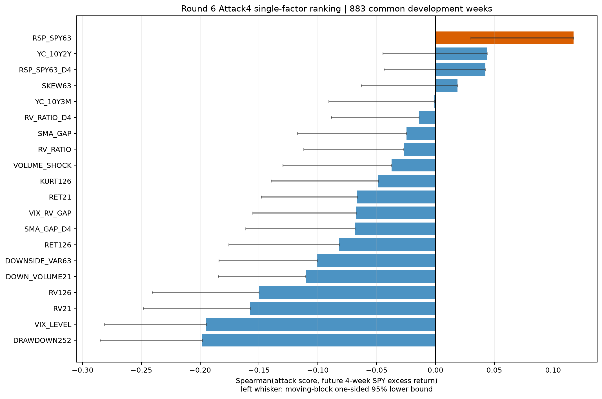

# R6B Attack4 单因子报告

R6B 已按预注册完成20个 arm：17个冻结 level 机械反号与3个固定 Delta4。全部 arm 在共同 development 样本均有883周；Delta4 在完整周历先 lag=4，再传播端点缺失。

RSP/SPY63 level 是唯一具有较清晰正向连续排序的因子：Spearman=0.1174，4周 moving-block 95%下界=0.0301、单侧 p=0.0145，B4 AUC=0.5988、causal-high lift=1.2015。但20项统一 BH 后 q=0.2900，且 positive-upside capture 仅21.06%，没有通过 robust-direct 门。

RSP/SPY63 Delta4 的 Spearman=0.0423，95%下界=-0.0437；其余大多数反向 level 为负。传统低波动、浅回撤或趋势恢复并没有在无条件四周进攻收益排序上重现稳定优势。B4与W4仅作为 guardrail，未产生独立晋级者。

