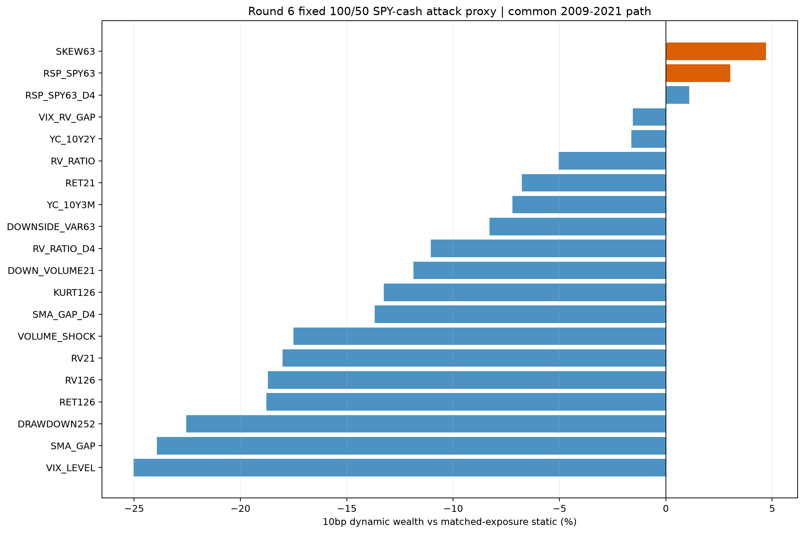

# R6C Attack4 固定角色代理报告

R6C 已使用唯一冻结测量尺完成：每个 execution year 只用以前年度、至少260周历史的 attack-score q75；高于阈值持有100% SPY，否则50%，主成本10bp，并与同平均暴露静态 SPY/cash 对照。

10bp下，Skew63 level 的 active terminal wealth 最高，为+4.70%；20bp仍为+2.39%，MDD也从静态-21.35%改善至-20.09%。但正主动年度仅7/13（53.85%），低于60%门，故不是 `economic_reference`。RSP/SPY63 level 在10/20bp下分别为+3.02%/+0.84%，但正年度同为53.85%，且动态MDD -21.33%略差于静态-20.74%，也未通过。

6个预注册 conditional arm 在 RSP-low 单元均未获得 block 下界>0且BH q<=0.10；conditional route 通过数为0。该批只是角色测量尺，没有生成最终risk-veto状态机。

