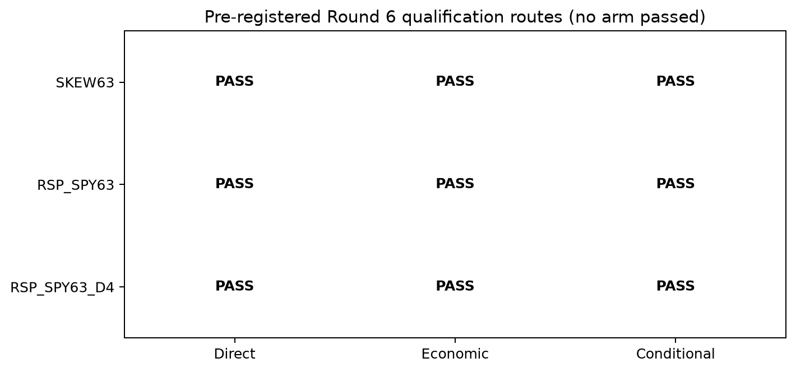

# R6D Attack4 稳健性与资格报告

R6D 已只读审计 R6A–R6C 并按计划硬停。20个 arm 均完成 native/common、4周与8周 block、年度、6个固定重大事件留一、四档成本与 RSP-low 条件检查。

最终三条资格路线均为0：

- `robust_direct_attack = 0`；
- `economic_reference = 0`；
- `conditional_role_pass = 0`；
- `model_input_eligible = 0`。

RSP/SPY63 level 的事件留一最小 Spearman 仍为0.0969，说明正向排序不是单一大事件制造；它失败在20项BH、upside capture与经济年度/MDD门。Skew63 的经济终值为正，但失败在统计、年度比例和事件稳定性。没有因“接近门槛”而补位。

程序 assessment 为 `completed_no_attack_role_candidate`，模型、bagging/stacking、最终状态机、2022–2026锁箱与 `mom_255_0` 迁移仍未授权。

