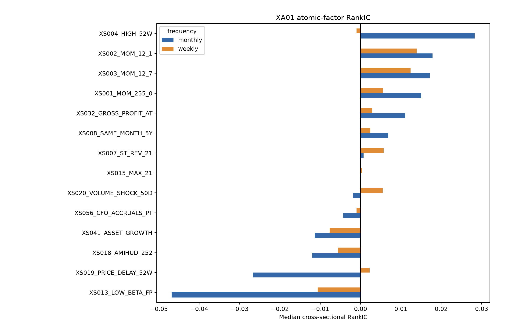
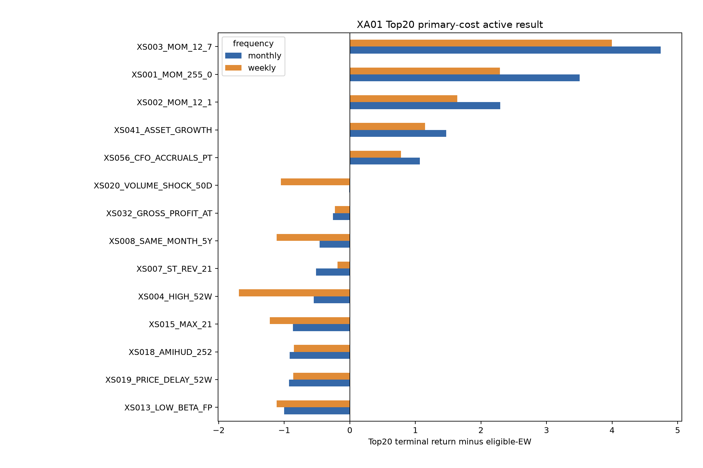

# XA01 atomic-factor walk-forward report

XA01 completed all four preregistered batches and hard-stopped before models, aggregation or P00 transfer.

## Decision

- Evidence-qualified factor-frequency cells: 0/28.
- Dimension representatives: XS003_MOM_12_7 at weekly and monthly frequency.
- Lockbox read: false; evidence is full-history causal/prequential exploration.
- G00 identity: 16/24 exact; Top10/Top20 exact. Top50 differs slightly in a pattern consistent with stricter complete-window eligibility, but exact ranking-level attribution remains open.

## Representative evidence

- monthly: median RankIC 0.0172, BH q 0.708, Top20 active terminal difference 4.743, active Sharpe difference 0.390; 4/4 TopK and 4/4 cost scenarios positive.
- weekly: median RankIC 0.0124, BH q 0.251, Top20 active terminal difference 3.996, active Sharpe difference 0.328; 4/4 TopK and 4/4 cost scenarios positive.

The representative label does not override the failed FDR gate. The next aggregation experiment may use it as the trend-family diversity control, while other dimensions remain unrepresented unless a new plan authorizes expanded candidates.

## Figures

