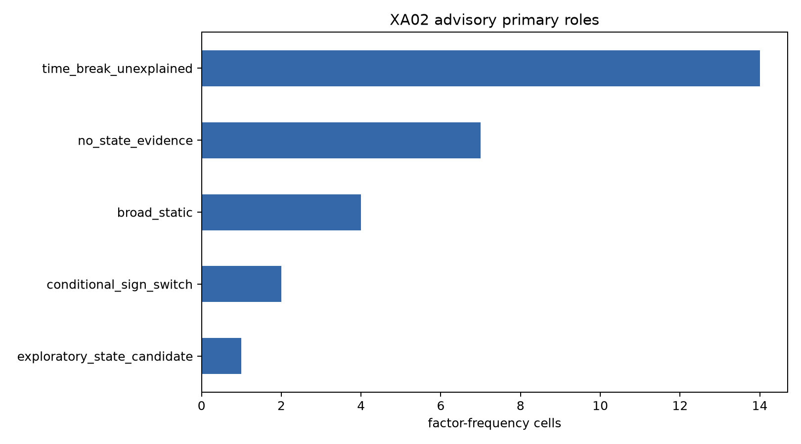
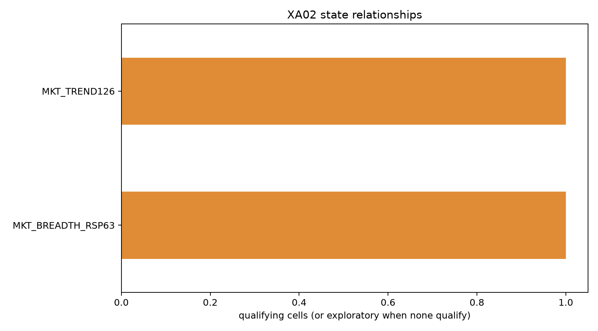

# XA02 factor performance and market-state atlas report

XA02 completed XA02A through XA02D and hard-stopped before model design.

## Result boundary

- One-dimensional qualifying relationships: 2.
- Robust two-dimensional contexts: 0.
- Exploratory two-dimensional contexts: 0.
- Models, aggregation, strategy selection, market-state classifier, P00 and lockbox: not run.

## Main findings

- Monthly `XS002_MOM_12_1` has a repeatable relation with the causal
  `MKT_BREADTH_RSP63` terciles (BH q=0.079). Its Top20 active mean is -0.53%
  per month in the low-breadth bin, +2.83% in the middle bin and +0.89% in the
  high bin. The registered best-minus-worst effect annualizes to 40.35%; all
  leave-one-year-out runs retain the direction. This is a non-linear middle-
  breadth advantage, not a claim that ever-higher breadth is always better.
- Monthly `XS008_SAME_MONTH_5Y` has a repeatable relation with
  `MKT_TREND126` (BH q=0.079). Its active mean is +0.95%, +1.28% and -1.33%
  per month in low, middle and high trend terciles. The registered
  best-minus-worst effect annualizes to 31.31%, again with 100% estimable
  leave-one-year-out directional agreement.
- The broad-static tag is retained for monthly `XS003_MOM_12_7`, weekly and
  monthly `XS041_ASSET_GROWTH`, and monthly `XS056_CFO_ACCRUALS_PT`. At their
  primary Top20 costs their relative wealth gains versus their own eligible-EW
  controls are respectively +173.2%, +44.9%/+56.9%, and +52.1%.
- Fourteen factor-frequency cells have a fixed-period sign break that none of
  the six primary state axes explains under the registered gates. This is a
  diagnostic result, not an automatic reason to delete or promote them.
- No registered two-dimensional interaction survives the complete FDR,
  effect-size, stability and replication stack. XA02 therefore gives no basis
  for automatically constructing a discrete market-state selector.

## Figures

The advisory ledger requires user review before any XA03 model inputs or targets are frozen.
