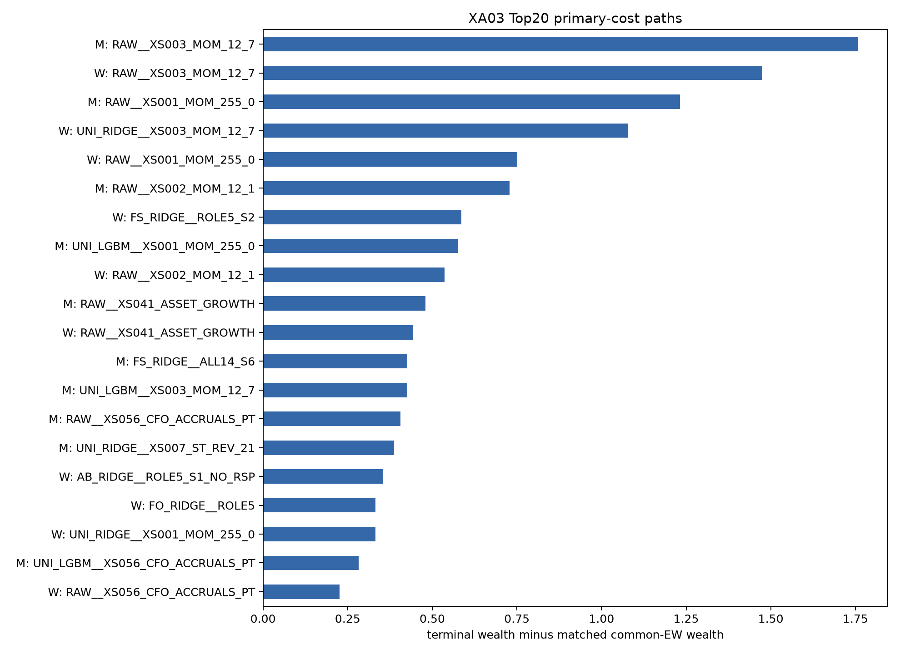
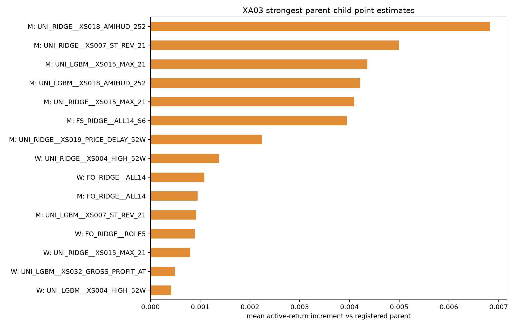
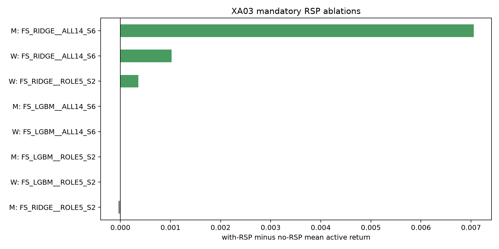

# XA03 rolling cross-sectional aggregation report

XA03A through XA03E completed and the program hard-stopped before P00, bagging, stacking, lockbox use, or automatic model selection.

## Result boundary

- Registered process-frequency cells: 114; TopK paths: 456; cost paths: 1,824.
- Mechanically qualified cells: 0.
- Invalid cells retained rather than replaced: 20.
- RSP-increment-supported cells: 1.
- Evidence remains exploratory full-history prequential evidence (`formal_eligible=false`).

## Main findings

The raw intermediate-horizon momentum factor remained the strongest economic path. Weekly Top20 at 10 bps was `RAW__XS003_MOM_12_7` with CAGR 23.99%, daily MDD -32.49%, active IR 0.709, and terminal wealth advantage 1.475 versus matched common-EW. Monthly Top20 at 5 bps was `RAW__XS003_MOM_12_7` with CAGR 25.14%, daily MDD -34.49%, active IR 0.829, and terminal wealth advantage 1.758.

No fitted single-factor or aggregate process passed the complete absolute and parent-increment qualification stack after registered multiplicity and stability gates. Restricted aggregate LightGBM cells were invalid because the frozen independent-date/calendar-year leaf-support constraint could not be met; they were not silently replaced by Ridge or a looser tree.

The sole supported RSP ablation was `FS_RIDGE__ALL14_S6` at monthly frequency: mean economic increment 0.007054, economic q=0.0712. This supports an RSP-dependent interaction in that one model comparison, but the model itself did not qualify absolutely or incrementally against its registered factor-only parent. It is mechanism evidence, not a deployable winner.

The event-driven repair replayed the unchanged frozen holdings through PIT membership, corporate actions, missing-price rules, and exact proportional transaction costs. The final runtime contains 3,226,608 daily NAV rows. Earlier period-proxy and missing-control-metadata attempts remain quarantined for provenance and are not published as results.

## Figures

## Decision

Do not advance an automatic XA03 champion. Preserve raw `XS003_MOM_12_7` as the primary single-factor benchmark, keep the monthly ALL14 Ridge plus state/RSP result as a narrowly scoped interaction hypothesis, and review model-capacity design before authorizing any XA04 or P00 transfer.
